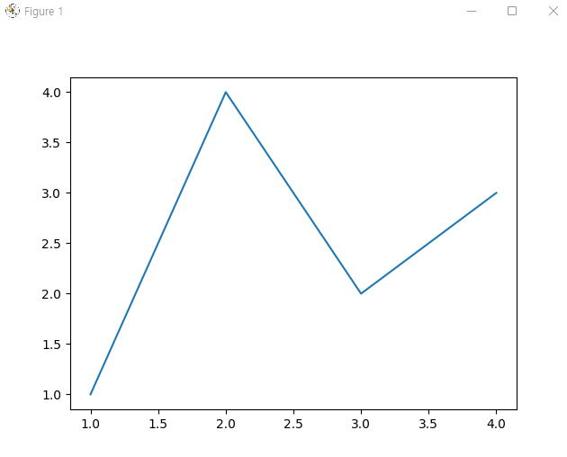
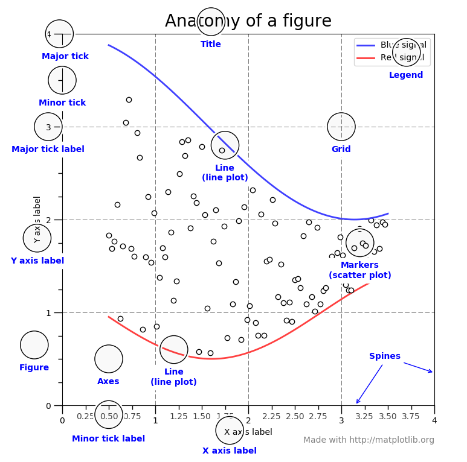

# Matplotlib 가이드  

* [Matplotlib 설치 가이드](#matplotlib-install-guide)
* [사용자 가이드](#matplotlib-user-guide)

## <a name="matplotlib-install-guide">Matplotlib 설치 가이드 </a>
Matplotlib 릴리스는 PyPI에서 MacOS, Windows 및 리눅스용 휠 패키지로 사용할 수 있다. Numpy, Pandas 처럼 pip 로 설치하면 된다. 

```bash
python -m pip install -U pip 
python -m pip install -U matplotlib 

# At MacBook 
pip install matplotlib 

```
이 명령으로 소스에서 Matplotlib가 컴파일되고 컴파일에 문제가 있는 경우 --prefer-binary를 추가하여 OS 및 파이썬용으로 미리 컴파일된 휠이 있는 최신 버전의 Matplotlib를 선택할 수 있다. 

### Conda Packages 
```bash 
conda install matplotlib 
```

### Linux Package Manager
* Debian / Ubuntu : sudo apt-get install python3-matplotlib 
* Fedora : sudo dnf install python3-matplotlib 
* Red Hat : sudo yum install python3-matplotlib 
* Arch : sudo pacman -S python-matplotlib 

### 소스로 설치하기 
[소스는 여기](https://matplotlib.org/stable/users/installing_source.html#install-from-source)

### 개발중인 소스설치 
[소스는 여기](https://matplotlib.org/stable/devel/development_setup.html#installing-for-devs)


## <a name=matplotlib-user-guide>사용자 가이드</a>
이 튜토리얼에서는 Matplotlib 를 시작하는데 도움이 되는 몇가지 기본 사용 패턴과 모범 사례를 다룬다. 
```python 
import numpy as np
import matplolib.pyplot as plt 
```

### 간단한 예제 
matplotlib는 그림(예: 창, 주피터 위젯 등)에 데이터를 그래피로 표시하며, 각 그림에는 하나 이상의 축이 포함될 수 있다. (즉, 점이 xy 좌표 또는 극좌표의 세타-r로 지정될 수 있는 영역). 플롯 또는 3D 플롯의 xyz등). 축이 있는 그림을 만드는 가장 간단한 방법은 `pyplot.subplots`를 사용하는 것이다. 그런 다음 Axes.plot를 사용하여 축에 일부 데이터를 그릴 수 있다. 

```python
fig, ax = plt.subplots()            # 단일 좌표축을 포함하는 Figure를 생성
ax.plot([1, 2, 3, 4], [1, 4, 2, 3]) # 좌표축에 일부 데이터를 플로팅 한다. 

plt.show()
```
결과는 

다른 많은 플로팅 라이브러리나 언어에서는 좌표축을 명시적으로 생성할 필요가 없다. 예를 들어, matlab에서는 다음을 수행할 수 있다. 
```python
plot([1, 2, 3, 4], [1, 4, 2, 3])        % MATLAB plot 
```
원하는 그래프를 얻을수가 있다. 

실제로 matplotlib에서 동일한 작업을 수행할 수 있다. 각 축 그래프 방법에 대해 matplotlib.pyplot 모듈에는 "현재" 축에서 해당 플롯을 수행하는 해당 함수가 있다. 아직 존재하지 않습니다. 따라서 이전 예제는 다음과 같이 더 짧게 작성할 수 있다. 

```python
plt.plot([1 ,2 ,3, 4], [1, 4, 2, 3])        # Matplotlib plot. 
```
결과는 위와 같음 

### 그림의 일부 
matplotlib 그림의 구성 요소를 자세히 살펴보자. 



**그림(Figure)**<br>
전체 그림은 위와같으며, 그림은 모든 하위 축, '특수' 아티스트(제목, 그림 범례등) 및 캔버스를 추적한다. (캔버스에 대해 너무 걱정할 필요없다 실제로 그리기를 수행하여 플롯을 가져오는 개체이기 때문에 중요하지만 사용자에게는 거의 보이지 않는다.) Figure에는 여러 개의 축이 포함될 수 있지만 일반적으로 적어도 하나는 있다. 

새 그림을 만드는 가장 쉬운 방법은 pyplot을 사용하는 것이다. 
```python 
fig = plt.figure()                  # 축이 없는 빈 그림이다. 
fig, ax = plt.subplots()            # 축이 하나인 도형 
fig, axs = plt.subplots(2, 2)       # 축의 2x2 그리드가 있는 그림 
```
Figure와 함께 좌표축을 만드는 것이 편리하지만 나중에 좌표축을 추가하여 더 복잡한 좌표축 레이아웃을 허용할 수도 있다. 

**중심선(Axes)**<br>
이것들은 숫자 라인과 같은 객체이다. 그들은 그래프 한계를 설정하고 눈금(축의 표시)과 눈금 레이블(눈금에 레이블을 지정하는 문자열) 을 생성한다. 눈금의 위치는 Locator 개체에 의해 결정되고 눈금 레이블 문자열은 포맷터에 의해 형식이 지정된다. 올바른 로케이터와 포맷터를 조합하면 눈금 위치와 레이블을 매우 세밀하게 제어할 수 있다. 

**아티스트(Artist)**<br>
기본적으로 Figure에서 볼 수 있는 모든 것은 아티스트이다. (Figure, Axes 및 Axis 개체 포함). 여기에는 Text 개체, Line2D개체, 컬렉션 개체, Patch 개체 등이 포함된다. 그림이 렌더링되면 모든 아티스트가 캔버스에 그려진다. 대부분의 아티스트는 축에 묶여 있다. 이러한 아티스트는 여러축에서 공유하거나 한 축에서 다른 축으로 이동할 수 없다. 

### 플로팅 함수에 대한 입력 유형
모든 플로팅 함수는 numpy.array 또는 numpy.ma.masked_array를 입력으로 예상한다. pandas 데이터 개체 및 numpy.matrix와 같은 배열과 유사한 클래스는 의도한 대로 작동하거나 작동하지 않을 수 있다. 플로팅하기 전에 이를 numpy.array객체로 변환하는 것이 가장 좋습니다. 

예를 들어 pandas.DataFrame을 변환하려면, 
```python
a = pandas.DataFrame(np.random.rand(4, 5), columns = list('abcde'))
a_asarray = a.values 
```

numpy.matrix를 변환하려면 

```python
b = np.matrix([[1, 2], [3, 4]])
b_asarray = np.asarray(b)
```

### 객체 지향 인터페이스와 pyplot 인터페이스
위에서 언급했듯이 Matplotlib를 사용하는 기본적으로 두가지 방법이 있다. 
* 명시적으로 그림과 축을 만들고 이에 대한 메서드를 호출한다. (객체지향 스타일: OO방법 -> OO : Object Oriented)
* pyplot을 사용하여 그림과 축을 자동으로 생성 및 관리하고 플리팅에 pyplot 기능을 사용하는 방법

OO 스타일 
```python
x = np.linspace(0, 2, 100)

# OO 스타일에서도 '.pyplot.Figure'를 사용하여 그림을 그린다. 
fig, ax = plt.subplots()                    # Figure와 좌표축을 생성
ax.plot(x, x, label='linear')               # 좌표축에 일부 데이터를 플로팅 한다. 
ax.plot(x, x**2, label='quardratic')        # 좌표축에 더 많은 데이터를 플로팅 한다. 
ax.plot(x, x**3, label='cubic')             # 그리고 계속 
ax.set_xlabel('x label')                    # 좌표축에 x 레이블을 추가한다. 
ax.set_ylabel('y label')                    # 좌표축에 y 레이블을 추가한다. 
ax.set_title('Simple Plot')                 # 좌표축에 타이틀을 추가한다. 
ax.legend()                                 # Add a Legend. (범례를 추가한다.)
plt.show()

```

or pyplot-style 
```python
x = np.linspace(0, 2, 100)

plt.plot(x, x, label="linear")              # (암시적) 축에 일부 데이터를 플로팅 한다. 
plt.plot(x, x**2, label="quadratic")        # etc 
plt.plot(x, x**3, label="cubic")
plt.xlabel('x label')
plt.ylabel('y label')
plt.title("Simple Plot")
plt.legend()
plt.show()
```

또한 GUI 응용 프로그램에 matplotlib를 포함하는 경우 그림 생성 시에도 pyplot을 완전히 삭제하는 세 번째 접근 방식이 있습니다. (Embedding Matplotlib in graphical user interfaces](https://matplotlib.org/stable/gallery/index.html#user-interfaces))

matplotlib 의 문서와 예제는 OO와 pyplot 접근 방식(동일하게 강력함) 을 모두 사용하며 둘중 하나를 자유롭게 사용해야 한다. (그러나 둘 중 하나를 선택하여 혼합하는 대신 고수하는 것이 좋다.) 일반적으로 pyplot을 대화형 플로팅(예: 주피터 노트북) 으로 제한하고 비 대화형 플로팅 (더 큰 프로젝트의 일부로 재사용되는 함수 및 스크립트)에 OO스타일을 선호하는 것이 좋다. 

> **노트**
>> 이전 예제에서는 from pylab import *를 통해 소위 pylab 인터페이스를 대신 사용한 예제를 찾을 수 있다. 이 * import는 pyplot와 numpy에서 모두 가져오기 때문에 다음을 수행할 수 있다. 
>> ```python
>> x = linspace(0, 2, 100)
>> plot(x, x, label='linear')
>> ```
>> 더욱 MATLAB과 유사한 스타일을 제공한다. 이 접근 방식은 현재 권장되지 않으며 더 이상 사용되지 않는다. 야생에서 여전히 만날 수 있기 때문에 여기에서만 언급된다. 

일반적으로 동일한 플롯을 반복해서 만들지만 데이터 세트가 다르기 때문에 플롯을 수행하기 위해 특수 기능을 작성해야 한다. 권장되는 함수 서명은 다음과 같다. 

```python 
def my_plotter(ax, data1, data2, param_dict):
    """
    A helper function to make a graph

    Parameters
    ----------
    ax : Axes 
        The axes to draw to 
    data1 : array 
        The x data 
    
    data2 : array
        The y data 

    param_dict : dict 
        Dictionary of kwargs to pass to ax.plot 

    Returns 
    -------
    out : list
        list of artists added
    """
    out = ax.plot(data1, data2, **param_dict)
    return out
```

다음과 같이 사용가능하다. 
```python
data1, data2, data3, data4 = np.random.randn(4, 100)
fig, ax = plt.subplots(1, 1)
my_plotter(ax, data1, data2, {'marker': 'x'})
```

또는 2개의 하위 플롯을 갖고 싶다면 
```python
fig, (ax1, ax2) = plt.subplots(1, 2)
my_plotter(ax1, data1, data2, {'marker': 'x'})
my_plotter(ax2, data3, data4, {'marker': 'o'})
```

이러한 간단한 예의 경우 이 스타일은 과도하게 보이지만 그래프가 약간 더 복잡해지면 효과가 있다. 

### 백엔드 (Backends)
#### 백엔드가 뭐냐 ?
웹사이트와 메일링 리스트에 있는 많은 문서는 "백엔드"를 언급하며 많은 신규 사용자가 이 용어를 혼동한다. matplotlib는 다양한 사용 사례와 출력 형식을 대상으로 한다. 어떤 사람들은 파이썬 쉘에서 대화식으로 matplotlib를 사용하고 명령을 입력할 때 플로팅 창이 팝업된다. 어떤 사람들은 주피터 노트북을 실행하고 빠른 데이터 분석을 위해 인라인 플롯을 그린다. 다른 사람들은 matplotlib 를 PyQt 또는 PyGObject와 같은 그래픽 사용자 인터페이스에 포함하여 풍부한 응용 프로그램을 빌드한다. 어떤 사람들은 배치 스크립트에서 matplotlib를 사용하여 수치 시뮬레이션에서 포스트스크립트 이미지를 생성하고 다른 사람들은 웹 애플리케이션 서버를 실행하여 그래프를 동적으로 제공한다. 

이러한 모든 사용사례를 지원하기 위해 matplotlib는 다양한 출력을 대상으로 할 수 있으며 이러한 각 기능을 백엔드라고 한다. "프론트엔드"는 사용자가 직면하는 코드, 즉 플로팅 코드인 반면, "백엔드"는 그림을 만들기 위해 뒤에서 모든 힘든 작업을 수행한다. 백엔드에는 두가지 유형이 있다. 사용자 인터페이스 백엔드 (PyQt/PySide, PyGObject, Tkinter, wxPython 또는 macOS/Cocoa에서 사용); "대화형 백엔드"라고도 함) 및 이미지 파일을 만들기 위한 하드카피 백엔드(PNG, SVG, PDF, PS; "비대화형 백엔드"라고도 함)

#### 백엔드 선택하기 
백엔드를 구성하는 세가지 방법이 있다. 

* matplotlibrc 파일의 [rcParams["backend"]](https://matplotlib.org/stable/tutorials/introductory/customizing.html?highlight=backend#a-sample-matplotlibrc-file) 매개변수 
* [MPLBACKEND](https://matplotlib.org/stable/faq/environment_variables_faq.html#envvar-MPLBACKEND) 환경 변수
* 함수 [matplotlib.use()](https://matplotlib.org/stable/api/matplotlib_configuration_api.html#matplotlib.use)
 
 더 자세한 설명은 아래에... 

 이러한 구성이 여러 개 있는 경우 목록의 마지막 구성이 우선한다. 예를 들어 matplotlib.use()를 호출하면 matplotlibrc의 설정이 무시된다. 

 백엔드가 명시적으로 설정되지 않는 경우 matplotlib는 시스템에서 사용 가능한 항목과 GUI 이벤트 루프가 이미 실행 중인지 여부에 따라 사용 가능한 백엔드를 자동으로 감지한다. 리눅스에서 환경 변수 DISPLAY가 설정되지 않은 경우 "이벤트 루프"는 "헤드리스"로 식별되어 비대화형 백엔드(agg)로 폴백된다. 다른 모든 경우에는 대화형 백엔드가 선호된다. (일반적으로 최소한 tkagg를 사용할 수 있다.)

구성 방법에 대한 자세한 설명은 다음과 같습니다. 

   * matplotlibrc 파일에서 rcParams["backend"] 설정 : 
   ```bash 
   backend : qt5agg            #  안티그레인(agg) 렌더링과 함께 pyqt5 사용 
   ```
[스타일 시트 및 rcParam으로 matplotlib](https://matplotlib.org/stable/tutorials/introductory/customizing.html) 참조

   * MPLBACKEND 환경 변수 설정 : 
   현재 쉘 또는 단일 스크립트에 대해 환경 변수를 설정 할 수 있다. 

   유닉스에서는 
   ```bash 
   export MPLBACKEND=qt5agg
   python simpole_plotl.py 

   MPLBACKEND=qt5agg python simple_plot.py
   ```
    윈도우에서는 전자만 가능하다. 
   ```bash 
    set MPLBACKEND=qt5agg
    python simple_plot.py
   ```
   이 환경 변수를 설정하면 현재 작업 디렉토리에 matplotlibrc가 있더라도 모든 matplotlibrc의 백엔드 매개변수를 무시한다. 따라서 MPLBACKEND를 전역적으로 설정한다. (예: .bashrc 또는 .profile에 있는 경우 직관적이지 않은 동작으로 이어질 수 있으므로 권장하지 않음)
   * 스크립트가 특정 백엔드에 의존하는 경우 [matplotlib.use()](https://matplotlib.org/stable/api/matplotlib_configuration_api.html#matplotlib.use) 함수를 사용할 수 있다. 
   ```python
   import matplotlib 
   matplotlib.use('qt5agg')
   ```
이것은 Figure가 생성되기 전에 수행되어야 한다. 그렇지 않으면 matplotlib가 백엔드를 전환하지 못하고 importError를 발생시킬수 있음

사용자가 다른 백엔드를 사용하려는 경우 use 를 사용하려면 코드를 변경해야 한다. 따라서 절대적으로 필요한 경우가 아니면 use 를 명시적으로 호출하는 것을 피해야 한다. 

#### 내장 백엔드 
기본적으로 matplotlib는 화면 및 파일에 대한 출력과 함께 대화형 작업과 스크립트에서 플로팅을 모두 허용하는 기본 백엔드를 자동으로 선택해야 하므로 최소한 처음에는 백엔드에 대해 걱정할 필요가 없다. 가장 일반적인 예외는 파이썬 배포가 tkinter 없이 제공되고 다른 GUI 툴킷이 설치되어 있지 않은 경우 이다. 이것은 python-tk(또는 이와 유사한) 라는 리눅스 래키지를 설치해야 하는 특정 리눅스 배포판에서 발생한다. 

그러나, 그래픽 사용자 인터페이스 또는 웹 응용 프로그램 서버(웹 응용 프로그램 서버(Flask)에 포함)를 작성하거나 진행 상황에 대한 더 나은 이해가 필요한 경우 계속 읽으라. 그래픽 사용자 인터페이스에 대해 좀 더 사용자 정의할 수 있도록 matplotlib 는 렌더러(실제로 드로잉을 수행하는 것)의 개념을 캔버스(그림이 있는 곳)에서 분리한다. 사용자 인터페이스를 사용하여 그림의 래스터(픽셀) 이미지를 만드는 Agg이다. Qt5Agg, Qt4Agg, GTK3Agg, wxAgg, TkAgg 및 macosx 백엔드에서 사용된다. 대체 렌더러는 Qt5Cairo, Qt4Cairo등에서 사용되는 Cairo 라이브러리를 기반으로 한다. 

렌더링 엔진의 경우 벡터 또는 래스터 렌더러를 구별 할 수 도 있다. 벡터 그래픽 언어는 "이 지점에서 이 지점까지 선 그리기" 와 같은 그리기 명령을 실행하므로 스케일이 없으며 레스터 백엔드는 정확도가 DPI 설정에 따라 달라지는 선의 픽셀 표현을 생성한다. 

다음은 matplotlib 렌더러에 대한 요약이다. (각각에 대해 동일한 백엔드가 있다. 이들은 파일에 쓸수 있는 비대화형 백엔드이다.)

|렌더러|파일타입|설명|
|------|-------|----|
|AGG   |png    | 	raster graphics -- high quality images using the Anti-Grain Geometry engine|
|PDF   |pdf    | 	vector graphics -- Portable Document Format |
|PS    | ps, eps | vector graphics -- Postscript output|
|SVG   | svg   |  	vector graphics -- Scalable Vector Graphics|
|PGF   | pgf, pdf | vector graphics -- using the pgf package|
|Cairo | png, ps, pdf, svg | raster or vector graphics -- using the Cairo library|

비대화형 백엔드를 사용하여 플롯을 저장하려면 matplotlib.pyplot.savefig('filename') 메서드를 사용하라. 

다음은 지원되는 사용자 인터페이스 및 렌더러 조합이다. 이들은 화면에 표시할 수 있고 위의 ㅍ에서 적절한 렌더러를 사용하여 파일에 쓸수 있는 대화형 백엔드이다. 

|백엔드|설명|
|------|----|
|Qt5Agg|Qt5 캔버스에서 Agg 렌더링(PyQt5 필요). 이 백엔드는 %matplotlib qt5를 사용하여 IPython에서 활성화 할 수 있다. |
|ipympl|주피터 위젯에 포함된 Agg 렌더링. (ipympl 필요). 이 백엔드는 %matplotlib ipympl이 있는 주피터 노트북에서 활성화 할 수 있다.|
|GTK3Agg|GTK 3.x 캔버스에 대한 Agg 렌더링 (PyGObject 및 pycairo 또는 cairocffi 필요). 이 백엔드는 %matplotlib gtk3를 사용하여 IPython에서 활성화할 수 있습니다. |
|macosx|OSX에서 Cocoa 캔버스로의 Agg 렌더링. 이 백엔드는 %matplotlib osx를 사용하여 IPython에서 활성화 할 수 있다.|
|TkAgg|Tk 캔버스에 대한 Agg 렌더링(TkInter 필요). 이 백엔드는 %matplotlib tk를 사용하여 IPython에서 활성화할 수 있다. |
|nbAgg|주피터 클래식 노트북에 대화형 피규어를 포함시키십시오. 이 백엔드는 %matplotlib 노트북을 통해 주피터 노트북에서 활성화 할 수 있다. |
|WebAgg| show()에서 대화형 그림으로 토네이도 서버를 시작한다.|
|GTK3Cairo|GKT 3.x 캔버스로 카이로 렌더링(PyGObject 및 pycairo 또는 cairocffi 필요)|
|Qt4Agg| Qt4캔버스에 대한 Agg 렌더링 (PyQt4 또는 pyside필요). 이 백엔드는 %matplotlib qt4 를 사용하여 IPython에서 활성화 할수 있다. |
|wxAgg| wxWidgets 캔버스에 대한 Agg 렌더링(wxPython 4 필요). 이 백엔드는 %matplotlib wx를 사용하여 IPython에서 활성화 할수 있다. |

> 노트 
>> 내장 백엔드의 이름은 대소문자를 구분하지 않습니다. 예를 들어 'Qt5Agg' 및 'qt5agg'는 동일

**ipympl**<br>
주피터 위젯 생태계는 matplotlib에서 직접 지원하기에는 너무 빠르게 움직인다. ipympl을 설치하려면 
```bash 
pip install ipympl 
jupyter nbextension enable --py --sys-prefix ipympl 
```

or 
```bash 
conda install ipympl -c conda-forge
```
링크를 참조. [jupyter-matplotlib](https://github.com/matplotlib/jupyter-matplotlib)


**PyQt4 또는 PySide를 어떻게 선택하는가 ?**<br>
QT_API 환경 변수는 각각 PyQt4 또는 PySide를 사용하도록 pyqt 또는 pyside로 설정할 수 있다. 사용할 바인딩의 기본값은 PyQt4이므로 matplotlib는 먼저 가져오기를 시도합니다. 가져오기가 실패하면 PySide 가져오기를 시도합니다. 

**내장돼지 않은 백엔드 사용**<br>
더 일반적으로 위의 방법 중 하나를 사용하여 가져올 수 있는 백엔드를 선택할 수 있다. name.of.the.backend 가 백엔드를 포함하는 모듈인 경우, module://name.of.the.backend를 백엔드 이름으로 사용하십시오. matplotlib.use('module://name.of.the.backend').


### 대화형 모드란 ?
대화형 백엔드를 사용하면 ([백엔드란 무엇입니까 ?](https://matplotlib.org/stable/tutorials/introductory/usage.html#what-is-a-backend) 참조) 화면에 플로팅을 허용하지만 그 자체로 요구하거나 보장하지는 않는다. 화면에 플로팅이 발생하는지 여부와 화면에 플롯이 그려진 후 스크립트 또는 쉘 세션이 계속되는지 여부는 호출되는 함수와 메서드, matplotlib가 "대화식 모드"인지 여부를 결정하는 상태 변수에 따라 다릅니다. ".기본 부울 값은 matplotlibrc 파일에 의해 설정되며 다른 구성 매개변수처럼 사용자 정의할 수 있습니다. ([스타일 시트 및 rcParam으로 matplotlib 사용자 정의](https://matplotlib.org/stable/tutorials/introductory/customizing.html) 참조). [matplotlib.interactive()](https://matplotlib.org/stable/api/matplotlib_configuration_api.html#matplotlib.interactive)를 통해 설정할 수도 있고 [matplotlib.is_interactive()](https://matplotlib.org/stable/api/matplotlib_configuration_api.html#matplotlib.is_interactive)를 통해 값을 쿼리할 수도 있다. 스크립트에서든 쉘에서든 플로팅 명령 스트림 중간에 대화형 모드를 켜고 끄는 것은 거의 필요하지 않으며 잠재적으로 혼란스러울 수 있다. 다음에서는 모든 플로팅이 대화형 모드를 켜거나 끌 때 수행된다고 가정한다. 

> **노트**
>> 상호 작용, 특히 [show()](https://matplotlib.org/stable/api/_as_gen/matplotlib.pyplot.show.html#matplotlib.pyplot.show)의 역할과 동작과 관련된 주요 변경사항은 matplotlib 버전 1.0으로 전환하면서 이루어졌으며 버그는 1.0.1에서 수정되었습니다. 여기에서는 macosx를 부분적으로 제외하고 기본 대화형 백엔드에 대한 버전 1.0.1 동작을 설명한다. 

대화형 모드는 [matplotlib.pyplot.ion()](https://matplotlib.org/stable/api/_as_gen/matplotlib.pyplot.ion.html#matplotlib.pyplot.ion)을 통해 켜고 [matplotlib.pyplot.ioff()](https://matplotlib.org/stable/api/_as_gen/matplotlib.pyplot.ioff.html#matplotlib.pyplot.ioff) 를 통해 끌수도 있다. 

> **노트**
>> 대화형 모드는 ipython 및 일반 python 쉘의 적절한 백엔드에서 작동하지만 IDKE IDE에서는 작동하지 않습니다. 기본 백엔드가 대화형 기능을 지원하지 않는 경우 [백엔드란](https://matplotlib.org/stable/tutorials/introductory/usage.html#id2) 에서 설명한 방법을 사용하여 대화형 백엔드를 며잇적으로 활성화 할수 있다. 


**대화식 예제**<br>
일반 python 프롬프트에서 또는 옵션 없이 ipython을 호출한 후 다음을 시도하라
```python
import matplotlib.pyplot as plt 
plt.ion() 
plt.plot([1.6, 2.7])
plt.show()
```
그러면 플롯 창이 나타납니다. 터미널 프롬프트는 활성 상태를 유지하므로 다음과 같은 추가 명령을 입력할 수 있다. 
```python
plt.title("대화식 테스트")
plt.xlabel("index")
```
대부분의 대화형 백엔드에서 객체 지향 인터페이스를 통해 변경하면 Figure 창도 업데이트 됩니다. 예를 들어 Axes 인스턴스에 대한 참조를 가져오고 해당 인스턴스의 메서드를 호출합니다. 
```python
ax = plt.gca()
ax.plot([3.1, 2.2])
```
특정 백엔드 (예: maxosx) 또는 이전 버전의 matplotlib를 사용하는 경우 플롯에 새 행이 즉시 추가되지 않을 수 있습니다. 이 경우 플롯을 업데이트하기 위해 명시적으로 draw()를 호출해야 합니다. 
```python
plt.draw()
```

**비대화형 예제** <br>
이전 예에서와 같이 새 세션을 시작하되 이제 대화형 모드를 끈다. 
```python
import matplotlib.pyplot as plt 
plt.ioff()
plt.plot([1.6, 2.7])

```
아무 일도 일어나지 않았거나 최소한 화면에 아무 것도 나타나지 않았습니다. (변칙적인 macosx 백엔드를 사용하지 않는한). 플롯을 표시하려면 다음을 수행해야 합니다. 
```python
plt.show()
```
이제 플롯이 표시되지만 터미널 명령줄이 응답하지 않았습니다. pyplot.show()는 플롯 창을 수동으로 종료할 때까지 추가 명령의 입력을 차단합니다. 

강제로 차단 기능을 사용하는 것이 무슨 소용이 있습니까 ? 파일 내용을 화면에 표시하는 스크립트가 필요하다고 가정합니다. 그 줄거리를 보고 스크립트를 끝내고 싶습니다. show()와 같은 일부 차단 명령이 없으면 스크립트는 플롯을 플래시한 다음 화면에 아무 것도 남기지 않고 즉시 종료됩니다. 또한 비대화형 모드는 show()가 호출될 때까지 모든 그리기를 지연시킵니다. 이것은 스크립트의 한 줄이 새 기능을 추가 할때마다 플롯을 다시 그리는 것보다 더 효율적입니다. 

버전 1.0 이전에는 일반적으로 단일 스크립트에서 show()를 두번 이상 호출할 수 없었습니다. 버전 1.0.1 이상에서는 이 제한이 해제되어 다음과 같은 스크립트를 작성할 수 있다. 

```python
import numpy as np
import matplotlib.pyplot as plt 

plt.ioff() 
for i in range(3):
    plt.plot(np.random.rand(10))
    plt.show()
```
이렇게 하면 한 번에 하나씩 세 개의 플롯이 만들어진다. 즉, 첫번째 플롯이 닫히면 두 번째 폴롯이 표시됨. 

**요약** <br>
대화형 모드에서 pyplot 함수는 자동으로 화면에 그립니다. 대화식으로 플로팅할 때 pyplot 함수와 함께 객체 메서드 호출을 사용하는 경우 플롯을 새로 고칠 때마다 draw()를 호출한다. 

하나 이상의 Figure 를 생성하고 새로운 Figure 세트를 종료하거나 생성하기 전에 이를 표시하려는 스크립트에서 비대화형 모드를 사용합니다. 이 경우 show()를 사용하여 Figure 를 표시하고 수동으로 제거할 때까지 실행을 차단한다. 

### 성능 
대화형 모드에서 데이터를 탐색하든 프로그래밍 방식으로 많은 플롯을 저장하든 관계없이 렌더링 성능은 파이프라인에서 고통스러운 병목 현상이 될수 있습니다. Matplotlib 는 플롯의 모양을 약간 변경(설정 가능한 허용 오차로) 하는 대신 렌더링 시간을 크게 줄이는 몇 가지 방법을 제공한다. 렌더링 시간을 줄이는 데 사용할 수 있는 방법은 생성 중인 플롯 유형에 따라 다르다. 

**선분 단순화(Line segment simplification)**<br>
선 세그먼트가 있는 플롯(예: 일반적인 선 플롯, 폴리곤 윤곽선 등)의 경우 렌더링 성능은 rcParams["path.simplify"](기본값: True) 및 rcParams["path.simplify_threshold"](기본값 : 0.111111111111) , 다음과 같이 정의할 수 있다. matplotlibrc 파일에서 (matplotlibrc 파일에 대한 자세한 내용은 스타일시트 및 rcParams를 사용하여 Matplotlib 사용자 지정 참조). rcParams["path.simplify"](기본값: True)는 선분의 단순화 여부를 나타내는 부울이다.  rcParams["path.simplify_threshold"] (기본값: 0.111111111111)는 단순화된 선분의 양을 제어한다. 임계값이 높을수록 렌더링 속도가 빨라진다. 

다음 스크립트는 먼저 단순화 없이 데이터를 표시한 다음 동일한 데이터를 단순화하여 표시한다. 두가지 모두와 상호 작용해보라. 
```python 
import numpy as np
import matplotlib.pyplot as plt 
import matplotlib as mpl 

# setup and create the data to plot 
y = np.random.rand(100000)
y[50000:] *= 2
y[np.geomspace(10, 50000, 400).astype(int)] = -1 
mpl.rcParams['path.simplify'] = True

mpl.rcParams['path.simplify_threshold'] = 0.0
plt.plot(y)
plt.show()

mpl.rcParams['path.simplify_threshold'] = 1.0
plt.plot(y)
plt.show()
```
matplotlib 는 현재 기본적으로 1/9의 보수적인 단순화 임계값을 사용한다. 다른 값을 사용하도록 기본 설정을 변경하려면 matplotlibrc 파일을 변경 할 수 있다. 또는 대화식 플로팅(최대 단순화)을 위한 새 스타일과 출판 품질 플로팅(최소 단순화)을 위한 다른 스타일을 생성하고 필요에 따라 활성화할 수 있다. 이러한 작업을 수행하는 방법에 대한 지침은 스타일 시트 및 rcParam으로 matplotlib 사용자 지정을 참조

단순화는 벡터에 대한 다음 선분의 수직거리 (디스플레이 좌표 공간에서 측정)가 path.simplify_threshold 매개변수보다 클 때까지 선분을 단일 벡터로 반복적으로 병합하여 작동합니다. 

> **노트**
>> 버전 2.1에서 라인 세그먼트 단순화 방법과 관련된 변경 사항이 적용되었다. 2.1 이전에는 이러한 매개변수에 의해 렌더링 시간이 계속 향상되지만 일부 유형의 데이터에 대한 렌더링 시간은 버전 2.1 이상에서 크게 향상된다. 

