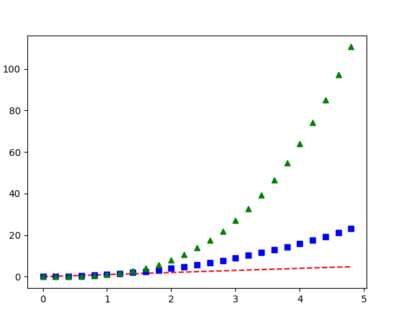

# 기본 사용방법

Ref Original URL : https://wikidocs.net/92071

plt.plot([1, 2, 3, 4]) 와 같이 입력하면 x 축 값은 자동으로 만들어 냅니다. 즉, 다음과 같이 만들어집니다. 

`plt.plot([0, 1, 2, 3], [1, 2, 3, 4])`

```python
import matplotlib.pyplot as plt 

# plt가 입력값을 y 값으로 알아서 가정한다. 
plt.plot([1, 2, 3, 4])
plt.show() 
```

```python 
import matplotlib.pyplot as plt 

plt.plot([1, 2, 3, 4], [1, 4, 9, 16])
plt.show()
```

### 스타일 지정하기 

x,y  값 인자에 대해 선의 색상과 형태를 지정하는 포맷 문자열(Format String)을 세번째 인자에 입력할 수 있다. 포맷 문자열 'ro'는 빨간색('red')의 원형 ('o') 마커를 의미한다. 또한 예를 들어 'b-'는 파란색 ('blue')의 실선('-')을 의미함. matplotlib.pyplot 모듈의 axis() 함수를 이용해서 축의 범위 [xmin, xmax, ymin, ymax] 를 지정 
```python 
import matplotlib.pyplot as plt 

plt.plot([1, 2, 3, 4], [1, 4, 9, 16], 'ro')
plt.axis([0, 6, 0, 20])
plt.show()
```

### 여러개의 그래프 그리기 
matplotlib에서는 일반적으로 Numpy 배열을 이용하게 됨. Numpy 사용하지 않더라도 모든 스퀀스는 내부적으로 Numpy 배열로 변환됨. 

`plt.plot(X, Y1, 'r--', X, Y2, 'bs', X, Y3, 'g^')`

```python
import matplotlib.pyplot as plt 
import numpy as np 

t = np.arange(0., 5., 0.2)

plt.plot(t, t, 'r--', t, t**2, 'bs', t, t**3, 'g^')
plt.show()
```
결과는 

### 숫자 입력하기 
matplotlib.pyplot 모듈의 plot()은 선(Line) 또는 마커(Marker) 그래프 그리기에 사용되는 함수이다. plot() 함수에 y값을 리스트 형태로 입력하면 위 그림과 같은 꺽은선 그래프가 그려짐. 

```python 
import matplotlib.pyplot as plt 

# 좌표는 y축으로 인식 
plt.plot([2, 3, 5, 10])
plt.show()
```

### x, y 값 입력하기 

```python 
import matplotlib.pyplot as plt 

plt.plot([1, 2, 3, 4], [2, 3, 5, 10])
plt.show() 
```
plot() 함수에 두개의 리스트를 입력하면 순서대로 x, y값들로 인식해서 점 `(1, 2), (2, 3), (3, 5), (4, 10)`를 잇는 꺽은선 그래프가 나타남 

### 레이블이 있는 데이터 사용하기 
파이썬 딕셔너리와 같이 레이블이 있는 데이터를 그래프로 나타낼수 있다. plot() 함수에 데이터의 레이블 (딕셔너리의 키)을 입력해주고, data 파라미터에 딕셔너리를 지정해줌. 
```python 
import matplotlib.pyplot as plt 

data_dict = {'data_x': [1, 2, 3, 4, 5], 'data_y': [2, 3, 5, 10, 8]}
plt.plot('data_x', 'data_y', data=data_dict)
plt.show()
```

### Matplotlib 축 레이블 설정하기 
matplotlib.pyplot 모듈의 xlabel(), ylabel() 함수를 사용하면 그래프의 x, y축에 대한 레이블을 표시할 수 있다. 이 페이지에서는 xlabel(), ylabel() 함수를 사용해서 그래프의 축에 레이블을 표시하는 방법은 
```python 
import matplotlib.pyplot as plt 

plt.plot([1, 2, 3, 4], [1, 4, 9, 16])
plt.xlabel('X-Label')
plt.ylabel('Y-Label')
plt.show() 
```

### 여백 지정
xlabel(), ylabel() 함수의 labelpad 파라미터는 축 레이블의 여백(Padding)을 지정한다. 예제에서는 X축 레이블에 대해서 15pt, y출 레이블에 대해 20pt 만큼의 여북 지정 

```python
import matplotlib.pyplot as plt 

plt.plot([1, 2, 3, 4], [2, 3, 5, 10])
plt.xlabel('X-Axis', labelpad = 15)
plt.ylabel('Y-Axis', labelpad = 20)
plt.show() 
```

### 폰트 설정하기 
xlabel(), ylabel() 함수의 fontdict 파라미터를 사용하면 축 레이블의 폰트 스타일을 설정할 수 있다. 

```python 
import matplotlib.pyplot as plt 

font1 = {'family': 'serif', 
        'color': 'b',
        'weight': 'bold',
        'size': 14
}
font2 = {'family': 'fantasy',
        'color': 'deeppink',
        'weight': 'normal',
        'size': 'xx-large'
}

plt.plot([1, 2, 3, 4], [2, 3, 5, 10])
plt.xlabel('X-Axis', labelpad = 15, fontdict = font1)
plt.ylabel('Y-Axis', labelpad = 20, fontdict = font2)

plt.show()
```

### 위치 지정하기 
xlabel() 함수의 loc 파라미터는 X축 레이블의 위치를 지정한다. ({'left', 'center', 'right'})
ylabel() 함수의 loc 파라미터는 Y축 레이블의 위치를 지정한다. ({'bottom', 'center', 'top'}) 이 파라미터는 Matplotlib 3.3 이후 버전부터 적용되었다. 

```python 
import matplotlib.pyplot as plt 

plt.plot([1, 2, 3, 4], [2, 3, 5, 10])
plt.xlabel('X-Axis', loc = 'right')
plt.ylabel('Y-Axis', loc = 'top')
plt.show()
```

### 범례 표시 
범례(Legend)는 그래프에 데이터의 종류를 표시하기 위한 텍스트 이다. matplotlib.pyplot 모듈의 Legend() 함수를 사용해서 그래프에 범례를 표시할 수 있다. 


#### 기본 사용 
그래프 영역에 범례 표시를 위해서 plot() 함수에 label 문자열을 지정하고 Legend() 함수를 호출한다. 

```python 

import matplotlib.pyplot as plt 

plt.plot([1, 2, 3, 4], [2, 3, 5, 10], label = 'Price ($)')
plt.xlabel('X-Axis')
plt.ylabel('Y-Axis')
plt.legend()

plt.show()

```
#### 위치 지정 
legend() 함수의 loc 파라미터를 이용해서 범례가 표시될 위치를 설정할 수 있음 loc 파라미터를 숫자 쌍 튜플로 지정하면, 해당 하는 위치에 범례가 표시됨. loc = (0.0, 0.0) 은 데이터 영역의 왼쪽 아래, loc=(1.0, 1.0)은 데이터 영역의 오른쪽 위 위치에 표시. 


```python 
import matplotlib.pyplot as plt 
plt.plot([1, 2, 3, 4], [2, 3, 5, 10], label= 'Price ($)')
plt.xlabel('X-Axis')
plt.ylabel('U-Axis')
plt.legend(loc=(1.0, 1.0))
```


```python 
import matplotlib.pyplot as plt 

plt.plot([1, 2, 3, 4], [2, 3, 5, 10], label = 'Price ($)')
plt.xlabel('X-Axis')
plt.ylabel('Y-Axis')
plt.legend(loc='lower right')

plt.show()
```
`lower right` 는 오른쪽 아래에 범례를 표시함. 


### 열 개수 지정하기 

legend() 함수의 ncol 파라미터는 범례에 표시될 텍스트의 열의 개수를 지정함. 
```python
import matplotlib.pyplot as plt 

plt.plot([1, 2, 3, 4], [2, 3, 5, 10], label = 'Price ($)')
plt.plot([1, 2, 3, 4], [3, 5, 9, 7], label = 'Demand (#)')
plt.xlabel('X-Axis')
plt.ylabel('Y-Axis')

# ncol이 2이면 두줄로 표현
plt.legend(loc = 'best', ncol = 2)

plt.show()
```


### 폰트 크기 지정하기 
legend() 함수의 fontsize 파라미터는 범례에 표시될 폰트의 크기 지정 
```python
import matplotlib.pyplot as plt 

plt.plot([1, 2, 3, 4], [2, 3, 5, 10], label = 'Price ($)')
plt.plot([1, 2, 3, 4], [3, 5, 9, 7], label = 'Demand (#)')
plt.xlabel('X-Axis')
plt.ylabel('Y-Axis')

plt.legend(loc='best', ncol= 2 , fontsize=14)

```

### 범례의 테두리 속성 지정 

frameon 파라미터는 범례 텍스트 상자위 테두리를 표시할지 여부를 지정하며 frameon = False 로 지정하면 테두리가 표시되지 않음. shadow 파라미터를 사용하서 텍스트 상자에 그림자를 표시할 수 있음 
```python
import matplotlib.pyplot as plt 

plt.plot([1, 2, 3, 4], [2, 3, 5, 10], label = 'Price ($)')
plt.plot([1, 2, 3, 4], [3, 5, 9, 7], label = 'Demand (#)')
plt.xlabel('X-Axis')
plt.ylabel('Y-Axis')

plt.legend(loc = 'best', ncol = 2, fontsize= 14, frameon = True, shadow = True)

plt.show()
```

이 외에도 legend() 함수에는 facecolor, edgecolor, borderpad, labelspacing 과 같은 다양한 파라미터가 있다. 

#### Location String 

| Location String | Location Code|
|-----------------|:----------:|
|'best'| 0|
|'upper right'| 1|
|'upper left'| 2|
|'lower left'| 3|
|'lower right'| 4|
|'right'| 5|
|'center left'| 6|
|'center right'| 7|
|'lower center'|8|
|'upper center'| 9|
|'center' | 10|


### 축 범위의 지정 
xlim() 함수에 xmin, xmax 값을 각각 입력하거나 리스트 또는 튜플의 형태로 입력한다. ylim()함수에 ymin, ymax 값을 각각 입력하거나 리스트 또는 튜플의 형태로 입력 입력값이 없으면 데이터에 맞게 자동으로 범위를 지정. 

```python
import matplotlib.pyplot as plt 

plt.plot([1, 2, 3, 4], [2, 3, 5, 10])
plt.xlabel('X-Axis')
plt.ylabel('Y-Axis')
plt.xlim([0, 5])    # X축의 범위 : [xmin, xmax]
plt.ylim([0, 20])   # Y축의 점위 : [ymin, ymax]

plt.show()
```

#### axis() 함수의 사용 
axis() 함수는 [xmin, xmax, ymin, ymax] 의 형태로 X, Y축의 점위를 지정할 수 있음. axis() 함수에 입력한 리스트 (또는 튜플)은 반드시 네 개의 값 (xmin, xmax, ymin, ymax)이 있어야 한다. 입력값이 없으면 데이터에 맞게 자동으로 범위를 지정. 

```python 
import matplotlib.pyplot as plt 

plt.plot([1, 2, 3, 4], [2, 3, 5, 10])
plt.xlabel('X-Axis')
plt.ylabel('Y-Axis')
plt.axis([0, 5, 0, 20])     # X, Y 축의 범위 : [xmin, xmax, ymin, ymax]

plt.show()
```

### 옵션 지정하기 
axis() 함수의 다양한 옵션 
`'on' | 'off' | 'equal' | 'scaled' | 'tight' | 'auto' | 'normal' | 'image' | 'square'`

```python 
import matplotlib.pyplot as plt 

plt.plot([1, 2, 3, 4], [2, 3, 5, 10])
plt.xlabel('X-Axis')
plt.ylabel('Y-Axis')
plt.axis('scaled')

plt.show()
```

### 축범위 얻기 
xlim() , ylim() 함수는 그래프 영역에 표시되는 X축, Y축의 점위를 각각 반환한다. axis()  함수는 그래프 영역에 표시되는 X, Y축의 범위를 반환

```python 
import matplotlib.pyplot as plt 

plt.plot([1, 2, 3, 4], [2, 3, 5, 10])
plt.xlabel('X-Axis')
plt.ylabel('Y-Axis')

x_range, y_range = plt.xlim(), plt.ylim()
print(x_range, y_range)

axis_range = plt.axis('scaled')
print(axis_range)
plt.show()
```

### 선 종류 지정 
선의 종류 : '-' (solid), '--'(Dashed), ':'(Dotted), '-.'(Dash-dot)
네가지 중에 선택이 가능하다. 
```python
import matplotlib.pyplot as plt 

plt.plot([1, 2, 3], [4, 4, 4], '-', color = 'C0', label = 'Solid')
plt.plot([1, 2, 3], [3, 3, 3], '--', color = 'C0', label = 'Dashed')
plt.plot([1, 2, 3], [2, 2, 2], ':', color = 'C0', label = 'Dotted')
plt.plot([1, 2, 3], [1, 1, 1], '-.', color='C0', label = 'Dash-dot')

plt.xlabel('X-Axis')
plt.ylabel('Y-Axis')
plt.axis([0.8, 3.2, 0.5, 5.0])
plt.legend(loc = 'upper right', ncol= 4)
plt.show()
```

#### linestyle 지정하기 
포맷 문자열과 같이 'solid', 'dashed', 'dotted', 'dashdot' 네가지의 선 종류를 지정할 수있다. 

```python 
import matploblit.pyplot as plt 

plt.plot([1, 2, 3], [4, 4, 4], linestyle='solid', color = 'C0', label = "'solid'")
plt.plot([1, 2, 3], [3, 3, 3], linestyle='dashed', color = 'C0', label = "'dashed'")
plt.plot([1, 2, 3], [2, 2, 2], linestyle='dotted', color = 'C0', label = "'dotted'")
plt.plt([1, 2, 3], [1, 1, 1], linestyle='dashdot', color = 'C0', label = "'dashdot'")

plt.xlabel('X-Axis')
plt.ylabel('Y-Axis')

plt.axis([0.8, 3.2, 0.5, 5.0])
plt.legend(loc = 'upper right', ncol = 4)
plt.tight_layout()
plt.show()
```

#### 튜플 사용하기 
튜플을 사용해서 선의 종류를 커스터마이즈 가능함. 

(0, (1, 1)) : dotted 
(0, (5, 5)) : dashed 
(0, (3, 5, 1, 5)) : dashdotted 


#### 선 끝 모양 지정하기 

plot() 함수의 solid_capstyle, dash_capstyle를 사용해서 선의 끝 모양을 지정할 수 있다. 각각 'butt', 'round'로 지정하면 뭉뚝한, 둥근 끝 모양으로 표현됨. 

```python 
import matplotlib.pyplot as plt 

plt.plot([1, 2, 3], [4, 4, 4], linestyle = 'solid', linewidth = 10, solid_capstyle = 'butt', color = 'C0', label = 'solid+butt')
plt.plot([1, 2, 3], [3, 3, 3], linestyle = 'solid', linewidth = 10, solid_capstyle = 'round', color = 'C0', label = 'solid+round')

plt.plot([1, 2, 3], [2, 2, 2], linestyle = 'dashed', linewidth = 10, dash_capstyle = 'butt', color = 'C1', label = 'dashed+butt')
plt.plot([1, 2, 3], [1, 1, 1], linestyle = 'dashed', linewidth = 10, dash_capstyle = 'round', color = 'C1', label = 'dashed+round')

plt.xlabel('X-Axis')
plt.ylabel('Y-Axis')
plt.axis([0.8, 3.2, 0.5, 5.0])
plt.legend(loc ='upper right', ncol = 2)
plt.tight_layout()
plt.show()
```