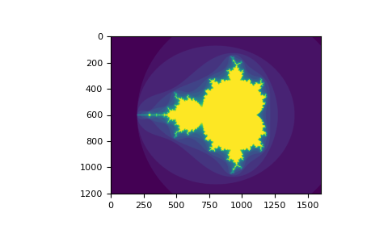

# <strong> 고급 인덱싱과 인덱스 팁 (Advanced indexing and index tricks)</strong>
Numpy는 일반 파이썬 시퀀스보다 더 많은 인덱싱 기능을 제공합니다. 정수 및 슬라이스로 인덱싱하는 것 외에도 이전에 보았듯이 배열은 정수 배열 및 부울 배열로 인덱싱할 수 있다. 

## <strong> 인덱스 배열로 인덱싱 하기 (Indexing with Arrays of Indices) </strong>

```python 
import numpy as np

a = np.arange(12)**2 			# the first 12 square numbers 
i = np.array(1, 1, 3, 8, 5]) 	# an array of indices 
print(a[i])						# the elements of `a` at the positions `i`
# array([ 1,  1,  9, 64, 25])
j = np.array([[3, 4], [9, 7]])	# a bidimensional array of indices 
print(a[j])						# the same shape as `j`
# array([[ 9, 16],
#       [81, 49]])
```
인덱싱된 배열 a가 다차원인 경우 단일 인덱스 배열은 첫번째 차원을 참조한다. 다음은 팔레트를 사용하여 레이블 이미지를 컬러 이미지로 변환하여 이 동작을 보여준다. 
```python

palette = np.array([[0, 0, 0],              # black 
                    [255, 0, 0],            # red 
                    [0, 255, 0],            # green
                    [0, 0, 255],            # blue 
                    [255, 255,255]])        # white 

image = np.array([[0, 1, 2, 0],             # each value corresponds to a color in the palette
                    [0, 3, 4, 0]])

palette[image]                              # the (2, 4, 3) color image 
# array([[[  0,   0,   0],
#        [255,   0,   0],
#        [  0, 255,   0],
#        [  0,   0,   0]],
#
#       [[  0,   0,   0],
#        [  0,   0, 255],
#        [255, 255, 255],
#        [  0,   0,   0]]])
```
하나 이상의 차원에 대한 인덱스를 제공할 수도 있다. 각 차원의 인덱스 배열은 모양이 같아야 한다. 
```python
a = np.arange(12).reshape(3, 4)
print(a) 

# array([[ 0,  1,  2,  3],
#       [ 4,  5,  6,  7],
#       [ 8,  9, 10, 11]])

i = np.array([[0, 1],                   # indices for the first dim of `a`(a의 첫번째 차원에 대한 인덱스)
                [1, 2]])
j = np.array([[2, 1],
                [3, 3]])                # indices for the second dim
print(a[i, j])                          # i and j must have equal shape 
# array([[ 2,  5],
#       [ 7, 11]])

print(a[i, 2])
# array([[ 2,  6],
#       [ 6, 10]])

print(a[:, j])
# array([[[ 2,  1],
#        [ 3,  3]],
#
#       [[ 6,  5],
#        [ 7,  7]],
#
#       [[10,  9],
#        [11, 11]]])

```
파이썬에서 arr[i, j]는 arr[(i, j)]와 동일하다. i와 j를 튜플에 넣고 인덱싱을 수행할수 있다. 
```python
l = (i, j)
print(a[l])

# array([[ 2,  5],
#       [ 7, 11]])
 
```
그러나 이 배열은 첫번째 차원을 인덱싱하는 것으로 해석되기 때문에 i 와 j를 배열에 넣어 이를 수행할 수 없다. 
```python
s = np.array([i, j])
# not what we want 
print(a[s])
Traceback (most recent call last):
    File "<stdin>", line 1, in <module>
IndexError: index 3 is out of bounds for axis 0 with size 3
# same as `a[i, j]`
a[tuple(s)]
# array([[ 2,  5],
#       [ 7, 11]])
```
배열을 사용한 인덱싱의 또 다른 일반적인 용도는 시간 종속 계열의 최대값을 검색하는 것이다. 
```python
time = np.linspace(20, 145, 5)                      # time scale 
data = np.sin(np.arange(20)).reshape(5, 4)          # 4 time-dependent series

print(time)
# array([ 20.  ,  51.25,  82.5 , 113.75, 145.  ])

print(data)
# array([[ 0.        ,  0.84147098,  0.90929743,  0.14112001],
#       [-0.7568025 , -0.95892427, -0.2794155 ,  0.6569866 ],
#       [ 0.98935825,  0.41211849, -0.54402111, -0.99999021],
#       [-0.53657292,  0.42016704,  0.99060736,  0.65028784],
#       [-0.28790332, -0.96139749, -0.75098725,  0.14987721]])

# index of the maxima for each series 
ind = data.argmax(axis=0)
print(ind)
# array([2, 0, 3, 1])

# times corresponding to the maxima 
time_max = time[ind]

data_max = data[ind, range(data.shape[1])]             # => data[ind[0], 0], data[ind[1], 1]...
print(time_max)
# array([ 82.5 ,  20.  , 113.75,  51.25])

print(data_max)
# array([0.98935825, 0.84147098, 0.99060736, 0.6569866 ])

print(np.all(data_max == data.max(axis = 0)))
# True
```
배열을 대상으로 인덱싱을 사용하여 다음에 할당 할 수도 있다. 
```python 
a = np.arange(5)

print(a) 
# array([0, 1, 2, 3, 4])
a[[1, 3, 4]] = 0

print(a)
# array([0, 0, 2, 0, 0])
```
그러나 인덱스 목록에 반복이 포함되어 있으면 할당이 여러번 수행되고 마지막 값이 남는다. 

```python
a = np.arange(5)
a[[0, 0, 2]] = [1, 2, 3]

print(a)
# array([2, 1, 3, 3, 4])
```
이것은 충분히 합리적이지만 python 의 += 구문을 사용하려는 경우 예상한 대로 작동하지 않을 수 있으므로 주의하십시오. 
```python 
a = np.arange(5)
a[[0, 0, 2]] += 1

print(a)
#  array([1, 1, 3, 3, 4])

```
인덱스 목록에서 0이 두 번 발생하더라도 0번째 요소는 한번만 증가한다. 이는 파이썬에서 a = a + 1과 동등하기 위해 a += 1이 필요하기 때문이다. 

## <strong> 부울 배열을 사용한 인덱싱 </strong>

인덱스 배열로 배열을 인덱싱 할때, 선택할 인덱스 목록을 제공한다. 부울 인덱스의 경우 접근 방식이 좀 다르다. 배열에서 원하는 항목과 원하지 않는 항목을 명시적으로 선택한다. 

부울 인덱싱에 대해 생각할 수 있는 가장 자연스러운 방법은 원래 배열과 모양이 동일한 부울 배열을 사용하는 것이다. 

```python 
a = np.arange(12).reshape(3, 4)
b = a > 4

print(b)                                    # `b` is a boolean with `a`'s shape 
# array([[False, False, False, False],
#       [False,  True,  True,  True],
#       [ True,  True,  True,  True]])

print(a[b])                                 # 1d array with the selected elements 
# array([ 5,  6,  7,  8,  9, 10, 11])
```
이 속성은 할당에서 매우 유용할 수 있다. 
```python
a[b] = 0            # All elements of `a` higher than 4 become 0 

print(a) 
# array([[0, 1, 2, 3],
#       [4, 0, 0, 0],
#       [0, 0, 0, 0]])
```
다음 예에서 부울 인덱싱을 사용하여 mandelbrot 세트의 이미지를 생성하는 방법을 확인할 수 있다. 

아래처럼 라이브러리를 설치하면 된다. 
```shell
pip install numpy 
pip install matplotlib 

```

```python
import numpy as np 
import matplotlib.pyplot as plt 

def mandelbrot(h, w, maxit = 30, r = 2):
    """ Returns an image of the Mandelbrot fractal of size (h, w)."""
    x = np.linspace(-2.5, 1.5, h*h+1)
    y = np.linspace(-1.5, 1.5, 3*w+1)

    A, B = np.meshgrid(x, y)
    C = A + B * 1j
    z = np.zeros_like(C) 
    divtime = maxit + np.zeros(z.shape, dtype=int)

    for i in range(maxit):
        z = z**2 + C
        diverge = abs(z) > r                    # who is diverging
        div_now = diverge & (divtime == maxit)  # who is diverging now 
        divtime[div_now] = i                    # note when 
        z[diverage] = r                         # avoid diverging to much
        
    return divtime 

plt.imshow(mandelbrot(400, 400))
```
Result : 



