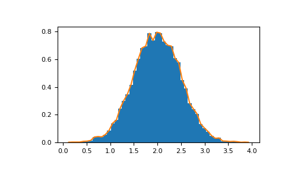

# <strong> 트릭과 팁(Trick and Tips)</strong>

## <strong> 자동으로 reshape 하기</strong>
배열의 차원을 변경하려면 크기 중 하나를 생략하면 자동으로 추론된다. 
```python
a = np.arange(30)
b = a.reshape((2, -1, 3))                   # -1 means "whatever is needed"

print(b.shape)
# (2, 5, 3)

print(b)
# array([[[ 0,  1,  2],
#        [ 3,  4,  5],
#        [ 6,  7,  8],
#        [ 9, 10, 11],
#        [12, 13, 14]],
#
#       [[15, 16, 17],
#        [18, 19, 20],
#        [21, 22, 23],
#        [24, 25, 26],
#        [27, 28, 29]]])
```

## <strong> 벡터 스태킹 (Vector Stacking) </strong>
동일한 크기의 행 벡터 목록에서 2d 배열을 구성하는 방법은 무엇일까 ? MATLAB에서는 매우 쉽다. x와 y 가 길이가 같은 두 벡터라면 m = [x;y]만 하면 된다. numpy에서 이것은 스태킹이 수행될 차원에 따라 column_stack, dstack, hstack, vstack 함수를 통해 해낼수 있다. 

```python
x = np.arange(0, 10, 2)
y = np.arange(5)
m = np.vstack([x, y])

print(m)
# array([[0, 2, 4, 6, 8],
#       [0, 1, 2, 3, 4]])

xy = np.hstack([x, y])
print(xy)
# array([0, 2, 4, 6, 8, 0, 1, 2, 3, 4])

```
2차원 이상에서 이러한 기능 뒤에 있는 논리는 이상할 수 있다. 

> 아래도 참고
>> [Numpy for MATLAB users](https://numpy.org/doc/stable/user/numpy-for-matlab-users.html)

## <strong> 히스토그램 (Histograms) </strong>
배열에 적용된 numpy 히스토그램 함수는 한 쌍의 벡터(배열의 히스토그램과 bin 가장자리의 벡터)를 반환한다. 주의 : matplotlib에는 numpy의 것과 다른 히스토그램(matlab에서와 같이 hist 라고함)을 작성하는 기능도 있다. 주요 차이점은 pylab.hist 는 히스토그램을 자동으로 그리는 반면 numpy.histogram은 데이터만 생성한다. 

```python
import numpy as np
import matplotlib.pyplot as plt 

rg = np.random.default_rng(1) 

# 분산이 0.5^2이고 평균이 2인 10000개의 정규 편차 벡터를 만든다. 
mu, sigma = 2, 0.5 

v = rg.normal(mu, sigma, 10000)

# 50개의 Bins 로 정규화된 히스토그램 플로팅 
plt.hist(v, bins = 50, density = True)                      # matplotlib version (plot)

# numpy로 히스토그램을 계산한 다음 플로팅 한다. 
(n, bins) = np.histogram(v, bins = 50, density = True)      # Numpy version (no plot)
plt.plot(.5 * (bins[1:] + bins[:-1]), n)
```


