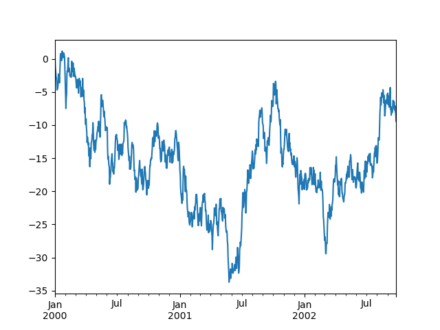
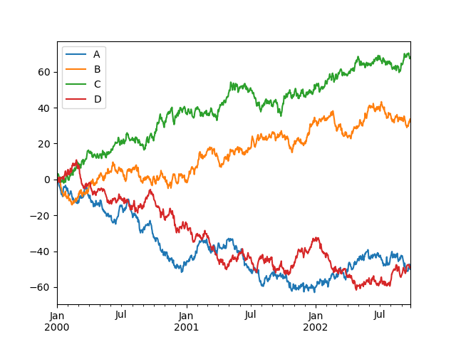

## <strong>Pandas </strong>
Pandas 는 Python 모듈이고 라이브러리이다. 데이터 구조 및 데이터 분석 도구를 제공하는 오픈소스이다. 

## <strong> 10분만에 Pandas 마스터 하기</strong>
이것은 주료 신규 사용자를 대상으로 하는 Pandas에 대한 짧은 소개이다.
더 자세한 사항은 [여기서](https://pandas.pydata.org/docs/user_guide/cookbook.html#cookbook) 볼수 있다.

보통은 아래처럼 라이브러리를 임포트 해준다. 
```python 

import numpy as np 
import pandas as pd 

```

## <strong> 객체 생성 (Object creation) </strong>

[링크](https://pandas.pydata.org/docs/user_guide/dsintro.html#dsintro)를 참조하라. 

값 목록을 전달하여 시리즈 생성, pandas가 기본 정수 인덱스 생성: 
```python
s = pd.Series([1, 3, 5, np.nan, 6, 8])

print(s) 
# 0    1.0
#1    3.0
#2    5.0
#3    NaN
#4    6.0
#5    8.0
#dtype: float64
```

날짜/시간 인덱스와 레이블이 지정된 열이 있는 Numpy 배열을 전달하여 DataFrame 만들기 
```python
dates = pd.date_range("20130101", periods = 6)
print(dates)
# DatetimeIndex(['2013-01-01', '2013-01-02', '2013-01-03', '2013-01-04',
#               '2013-01-05', '2013-01-06'],
#              dtype='datetime64[ns]', freq='D')
df = pd.DataFrame(np.random.randn(6, 4), index = dates, columns = list("ABCD"))

print(df)
#                    A         B         C         D
#2013-01-01  0.469112 -0.282863 -1.509059 -1.135632
#2013-01-02  1.212112 -0.173215  0.119209 -1.044236
#2013-01-03 -0.861849 -2.104569 -0.494929  1.071804
#2013-01-04  0.721555 -0.706771 -1.039575  0.271860
#2013-01-05 -0.424972  0.567020  0.276232 -1.087401
#2013-01-06 -0.673690  0.113648 -1.478427  0.524988
```

Json 형태의 Dictionary 를 전달하여 DataFrame 만들기 
```python

df2 = pd.DataFrame(
    {
        "A": 1.0,
        "B": pd.Timestamp("20130102"),
        "C": pd.Series(1, index = list(range(4)), dtype="float32"),
        "D": np.array([3] * 4, dtype="int32"),
        "E": pd.Categorical(["test", "train", "test", "train"]),
        "F": "foo",
    }
)
print(df2)
#      A          B    C  D      E    F
#0  1.0 2013-01-02  1.0  3   test  foo
#1  1.0 2013-01-02  1.0  3  train  foo
#2  1.0 2013-01-02  1.0  3   test  foo
#3  1.0 2013-01-02  1.0  3  train  foo
```
결과는 DataFrame의 열에는 다른 dtype 이 있다. 다음과 같이 

```python
print(df2.dtypes)
# A           float64
# B    datetime64[ns]
# C           float32
# D             int32
# E          category
# F            object
# dtype: object
```
## <strong> 데이터 보기 (Viewing Data) </strong>
여기도 [참고](https://pandas.pydata.org/docs/user_guide/basics.html#basics)할것.

프레임의 상단 및 하단 행을 보는 방법은 다음과 같다. 

```python
print(df.head())
#                    A         B         C         D
# 2013-01-01  0.469112 -0.282863 -1.509059 -1.135632
# 2013-01-02  1.212112 -0.173215  0.119209 -1.044236
# 2013-01-03 -0.861849 -2.104569 -0.494929  1.071804
# 2013-01-04  0.721555 -0.706771 -1.039575  0.271860
# 2013-01-05 -0.424972  0.567020  0.276232 -1.087401

print(df.tail(3))
#                    A         B         C         D
# 2013-01-04  0.721555 -0.706771 -1.039575  0.271860
# 2013-01-05 -0.424972  0.567020  0.276232 -1.087401
# 2013-01-06 -0.673690  0.113648 -1.478427  0.524988

```
열(index)과 행(column) 보여주기 
```python

print(df.index)
# DatetimeIndex(['2013-01-01', '2013-01-02', '2013-01-03', '2013-01-04',
#               '2013-01-05', '2013-01-06'],
#              dtype='datetime64[ns]', freq='D')
print(df.columns)
# Index(['A', 'B', 'C', 'D'], dtype='object')
DataFrame.to_numpy()는 기본 데이터의 numpy 표현을 제공한다. DataFrame에 다른 데이터 유형이 있는 열이 있는 경우 이는 비용이 많이 드는 작업이 될수 있다. 이는 pandas와 numpy 간의 근보ㅗㄴ적인 차이점으로 귀결된다. numpy 배열에는 전체 배열에 대해 하나의 dtype이 있는 반면 pandas DataFrame에는 열당 하나의 dtype이 있습니다. DataFrame.to_numpy()를 호출하면 pandas는 DataFrame의 모든 dtype을 보유할 수 있는 numpy dtype을 찾습니다. 이것은 결국 모든 값을 파이썬 객체로 캐스팅해야 하는 객체가 될수 있다. 

모든 부동 소수점 값의 DataFrame인 df의 경우 DataFrame.to_numpy()는 빠르고 데이터 복사가 필요하지 않는다. 

```python
print(df.to_numpy())
# array([[ 0.4691, -0.2829, -1.5091, -1.1356],
#       [ 1.2121, -0.1732,  0.1192, -1.0442],
#       [-0.8618, -2.1046, -0.4949,  1.0718],
#       [ 0.7216, -0.7068, -1.0396,  0.2719],
#       [-0.425 ,  0.567 ,  0.2762, -1.0874],
#       [-0.6737,  0.1136, -1.4784,  0.525 ]])
```
df2의 경우 여러 dtype이 있는 DataFrame인 DataFrame.to_numpy()는 상대적으로 비싸다. 

```python 
print(df2.to_numpy())
# array([[1.0, Timestamp('2013-01-02 00:00:00'), 1.0, 3, 'test', 'foo'],
       [1.0, Timestamp('2013-01-02 00:00:00'), 1.0, 3, 'train', 'foo'],
       [1.0, Timestamp('2013-01-02 00:00:00'), 1.0, 3, 'test', 'foo'],
       [1.0, Timestamp('2013-01-02 00:00:00'), 1.0, 3, 'train', 'foo']],
      dtype=object)
```
> <strong> Note</strong>
> [DataFrame.to_numpy()](https://pandas.pydata.org/docs/reference/api/pandas.DataFrame.to_numpy.html#pandas.DataFrame.to_numpy) 는 출력에 인덱스 또는 열 레이블을 포함하지 않는다. 

describe()는 데이터의 빠른 통계 요약을 보여준다. 
```python 
print(df.describe())
#             A         B         C         D
#count  6.000000  6.000000  6.000000  6.000000
#mean   0.073711 -0.431125 -0.687758 -0.233103
#std    0.843157  0.922818  0.779887  0.973118
#min   -0.861849 -2.104569 -1.509059 -1.135632
#25%   -0.611510 -0.600794 -1.368714 -1.076610
#50%    0.022070 -0.228039 -0.767252 -0.386188
#75%    0.658444  0.041933 -0.034326  0.461706
#max    1.212112  0.567020  0.276232  1.071804
```

데이터 전치하기 
```python 
print(df.T)
#    2013-01-01  2013-01-02  2013-01-03  2013-01-04  2013-01-05  2013-01-06
#A    0.469112    1.212112   -0.861849    0.721555   -0.424972   -0.673690
#B   -0.282863   -0.173215   -2.104569   -0.706771    0.567020    0.113648
#C   -1.509059    0.119209   -0.494929   -1.039575    0.276232   -1.478427
#D   -1.135632   -1.044236    1.071804    0.271860   -1.087401    0.524988
```

축을 기준으로 정렬하기 
```python
print(df.sort_index(axis = 1, ascending = False))
# 2013-01-01 -1.135632 -1.509059 -0.282863  0.469112
# 2013-01-02 -1.044236  0.119209 -0.173215  1.212112
# 2013-01-03  1.071804 -0.494929 -2.104569 -0.861849
# 2013-01-04  0.271860 -1.039575 -0.706771  0.721555
# 2013-01-05 -1.087401  0.276232  0.567020 -0.424972
# 2013-01-06  0.524988 -1.478427  0.113648 -0.673690
```

값을 기준으로 정렬하기 
```python
print(df.sort_values(by="B"))
#                    A         B         C         D
# 2013-01-03 -0.861849 -2.104569 -0.494929  1.071804
# 2013-01-04  0.721555 -0.706771 -1.039575  0.271860
# 2013-01-01  0.469112 -0.282863 -1.509059 -1.135632
# 2013-01-02  1.212112 -0.173215  0.119209 -1.044236
# 2013-01-06 -0.673690  0.113648 -1.478427  0.524988
# 2013-01-05 -0.424972  0.567020  0.276232 -1.087401
```

## <strong>선택 (Selection) </strong>
> **참고**
>> 선택 및 설정을 위한 표준 Python/Numpy 표현식은 직관적이고 대화식 작업에 유용하지만 프로덕션 코드의 경우 최적화된 pandas 데이터 액세스 방법인 .at, .iat, .loc 및 iloc을 권장한다. 

[인덱싱 및 데이터 선택](https://pandas.pydata.org/docs/user_guide/indexing.html#indexing) 및 [MultiIndex / 고급 인덱싱](https://pandas.pydata.org/docs/user_guide/advanced.html#advanced)

### <strong>구하기 (Getting)</strong>
df.A와 동일한 시리즈를 생성하는 단일 열 선택 

```python 
print(df["A"])
# 2013-01-01    0.469112
# 2013-01-02    1.212112
# 2013-01-03   -0.861849
# 2013-01-04    0.721555
# 2013-01-05   -0.424972
# 2013-01-06   -0.673690
# Freq: D, Name: A, dtype: float64
```

행을 슬라이스하는 []를 통해 선택한다. 
```python
print(df[0:3])
#                    A         B         C         D
# 2013-01-01  0.469112 -0.282863 -1.509059 -1.135632
# 2013-01-02  1.212112 -0.173215  0.119209 -1.044236
# 2013-01-03 -0.861849 -2.104569 -0.494929  1.071804

print(df["20130102":"20130104"])
#                    A         B         C         D
# 2013-01-02  1.212112 -0.173215  0.119209 -1.044236
# 2013-01-03 -0.861849 -2.104569 -0.494929  1.071804
# 2013-01-04  0.721555 -0.706771 -1.039575  0.271860
```
### <strong> 라벨로 선택하기 (Selection by label) </strong>
>참조
>> [보다 더 많은 정보](https://pandas.pydata.org/docs/user_guide/indexing.html#indexing-label)

레이블을 사용하여 횡단면 가져오기
```python
print(df.loc[dates[0]])
# A    0.469112
# B   -0.282863
# C   -1.509059
# D   -1.135632
# Name: 2013-01-01 00:00:00, dtype: float64
```

레이블로 다중 축을 선택하기 
```python
print(df.loc[:, ["A", "B"]])
#                    A         B
# 2013-01-01  0.469112 -0.282863
# 2013-01-02  1.212112 -0.173215
# 2013-01-03 -0.861849 -2.104569
# 2013-01-04  0.721555 -0.706771
# 2013-01-05 -0.424972  0.567020
# 2013-01-06 -0.673690  0.113648
```

레이블 슬라이싱을 표시하면 두 끝점이 모두 포함됨. 
```python
print(df.loc["20130102":"20130104", ["A", "B"]])
#                    A         B
# 2013-01-02  1.212112 -0.173215
# 2013-01-03 -0.861849 -2.104569
# 2013-01-04  0.721555 -0.706771
```

반환개체의 크기 축소
```python
print(df.loc["20130102", ["A", "B"]])
# A    1.212112
# B   -0.173215
# Name: 2013-01-02 00:00:00, dtype: float64
```
스칼라 값을 얻으려면 
```python
print(df.loc[date[0], "A"])
# 0.4691122999071863
```

스칼라에 빠르게 액세스하려면 (이전 방법과 동일하다.)
```python
print(df.at[dates[0], "A"])
# 0.4691122999071863
```

### **위치로 선택하기 (Selection by position)**
보다 더 자세한 사항은 [여기](https://pandas.pydata.org/docs/user_guide/indexing.html#indexing-integer)

전달된 정수의 위치를 통해서 선택하기 
```python 
print(df.iloc[3])
# A    0.721555
# B   -0.706771
# C   -1.039575
# D    0.271860
# Name: 2013-01-04 00:00:00, dtype: float64
```

Numpy/Python과 유사하게 작동하는 정수 조각
```python
print(df.iloc[3:5, 0:2])
#                    A         B
# 2013-01-04  0.721555 -0.706771
# 2013-01-05 -0.424972  0.567020
```

Numpy/Python 스타일과 유사한 정수 위치 목록으로 선택하기 
```python 
print(df.iloc[[1, 2, 4], [0, 2]])
#                    A         C
# 2013-01-02  1.212112  0.119209
# 2013-01-03 -0.861849 -0.494929
# 2013-01-05 -0.424972  0.276232
```

행을 명시적으로 슬라이싱하는 경우 
```python
print(df.iloc[1:3, :])
#                    A         B         C         D
# 2013-01-02  1.212112 -0.173215  0.119209 -1.044236
# 2013-01-03 -0.861849 -2.104569 -0.494929  1.071804
```

행을 명시적으로 슬라이싱하는 경우: 
```python 
print(df.iloc[:, 1:3])
#                    B         C
# 2013-01-01 -0.282863 -1.509059
# 2013-01-02 -0.173215  0.119209
# 2013-01-03 -2.104569 -0.494929
# 2013-01-04 -0.706771 -1.039575
# 2013-01-05  0.567020  0.276232
# 2013-01-06  0.113648 -1.478427
```

명시적으로 값을 얻으려면
```python 
print(df.iloc[1, 1])
# -0.17321464905330858
```

스칼라에 빠르게 액세스하려면 (이전 방법과 동일)
```python
print(df.iat[1, 1])
# -0.17321464905330858
```

### **부울 인덱싱 (Boolean Indexing)**
단일 열의 값을 사용하여 데이터 선택 

```python 
print(df[df["A"] > 0])
#                    A         B         C         D
# 2013-01-01  0.469112 -0.282863 -1.509059 -1.135632
# 2013-01-02  1.212112 -0.173215  0.119209 -1.044236
# 2013-01-04  0.721555 -0.706771 -1.039575  0.271860
```

부울 조건이 충족되는 DataFrame에서 값을 선택하기 
```python
print(df[df > 0])
#                    A         B         C         D
# 2013-01-01  0.469112       NaN       NaN       NaN
# 2013-01-02  1.212112       NaN  0.119209       NaN
# 2013-01-03       NaN       NaN       NaN  1.071804
# 2013-01-04  0.721555       NaN       NaN  0.271860
# 2013-01-05       NaN  0.567020  0.276232       NaN
# 2013-01-06       NaN  0.113648       NaN  0.524988
```

필터링을 위해 isin() 메서드 사용
```python 
df2 = df.copy()
df2["E"] = ["one", "one", "two", "three", "four", "three"]
print(df2)
#                    A         B         C         D      E
# 2013-01-01  0.469112 -0.282863 -1.509059 -1.135632    one
# 2013-01-02  1.212112 -0.173215  0.119209 -1.044236    one
# 2013-01-03 -0.861849 -2.104569 -0.494929  1.071804    two
# 2013-01-04  0.721555 -0.706771 -1.039575  0.271860  three
# 2013-01-05 -0.424972  0.567020  0.276232 -1.087401   four
# 2013-01-06 -0.673690  0.113648 -1.478427  0.524988  three
```
```python 
print(df2[df2["E"].isin(["two", "four"])])
#                    A         B         C         D     E
# 2013-01-03 -0.861849 -2.104569 -0.494929  1.071804   two
# 2013-01-05 -0.424972  0.567020  0.276232 -1.087401  four
```

### **설정하기 (Setting)**
새 열을 설정하면 인덱스별로 데이터가 자동으로 정렬된다. 

```python 
s1 = pd.Series([1, 2, 3, 4, 5, 6], index = pd.date_range("20130102", periods = 6))

print(s1)
# 2013-01-02    1
# 2013-01-03    2
# 2013-01-04    3
# 2013-01-05    4
# 2013-01-06    5
# 2013-01-07    6
# Freq: D, dtype: int64
df["F"]  = s1
```

라벨로 값을 설정하고 
```python 
df.at[dates[0], "A"] = 0 
```

위치에 값을 설정하고 
```python
df.iat[0, 1] = 0
```

Numpy 배열로 할당하여 설정: 
```python
df.loc[:, "D"] = np.array([5] * len(df))
```

이전 설정 작업의 결과
```python
print(df)
#                    A         B         C  D    F
# 2013-01-01  0.000000  0.000000 -1.509059  5  NaN
# 2013-01-02  1.212112 -0.173215  0.119209  5  1.0
# 2013-01-03 -0.861849 -2.104569 -0.494929  5  2.0
# 2013-01-04  0.721555 -0.706771 -1.039575  5  3.0
# 2013-01-05 -0.424972  0.567020  0.276232  5  4.0
# 2013-01-06 -0.673690  0.113648 -1.478427  5  5.0
```

설정이 있는 where 작업하기 
```python
df2 = df.copy()
df2[df2 > 0] = -df2
print(df2)
#                    A         B         C  D    F
# 2013-01-01  0.000000  0.000000 -1.509059 -5  NaN
# 2013-01-02 -1.212112 -0.173215 -0.119209 -5 -1.0
# 2013-01-03 -0.861849 -2.104569 -0.494929 -5 -2.0
# 2013-01-04 -0.721555 -0.706771 -1.039575 -5 -3.0
# 2013-01-05 -0.424972 -0.567020 -0.276232 -5 -4.0
# 2013-01-06 -0.673690 -0.113648 -1.478427 -5 -5.0
```

## <strong> 데이터 누락 (Missing Data) </strong>
pandas 는 주로 np.nan값을 사용하여 누락된 데이터를 나타낸다. 기본적으로 계산에 포함되지 않는다. [누락된 데이터 섹션 참조](https://pandas.pydata.org/docs/user_guide/missing_data.html#missing-data)

재인덱싱을 사용하면 지정된 축의 인덱스를 변경/추가/삭제할 수 있다. 그러면 데이터 복사본이 반환됨. 

```python 
df1 = df.reindex(index = dates[0:4], columns = list(df.columns) + ["E"])
df1.loc[dates[0] : dates[1], "E"] = 1

print(df1)
#                    A         B         C  D    F    E
# 2013-01-01  0.000000  0.000000 -1.509059  5  NaN  1.0
# 2013-01-02  1.212112 -0.173215  0.119209  5  1.0  1.0
# 2013-01-03 -0.861849 -2.104569 -0.494929  5  2.0  NaN
# 2013-01-04  0.721555 -0.706771 -1.039575  5  3.0  NaN
```

누락된 데이터가 있는 행을 삭제한다. 
```python
print(df1.dropna(how = "any"))
#                    A         B         C  D    F    E
# 2013-01-02  1.212112 -0.173215  0.119209  5  1.0  1.0
```

누락된 데이터로 채우기 
```python
print(df1.fillna(value = 5))
#                    A         B         C  D    F    E
# 2013-01-01  0.000000  0.000000 -1.509059  5  5.0  1.0
# 2013-01-02  1.212112 -0.173215  0.119209  5  1.0  1.0
# 2013-01-03 -0.861849 -2.104569 -0.494929  5  2.0  5.0
# 2013-01-04  0.721555 -0.706771 -1.039575  5  3.0  5.0
```

값이 nan인 부울 마스크를 얻으려면 
```python
print(pd.isna(df1))
#                 A      B      C      D      F      E
# 2013-01-01  False  False  False  False   True  False
# 2013-01-02  False  False  False  False  False  False
# 2013-01-03  False  False  False  False  False   True
# 2013-01-04  False  False  False  False  False   True
```


## <strong> 운영?? (Operations) </strong>
[Binary Ops의 기본 섹션](https://pandas.pydata.org/docs/user_guide/basics.html#basics-binop)

### **Stats**
일반적으로 작업은 누락된 데이터를 제외한다. 

기술 통계 수행 
```python 
print(df.mean())
# A   -0.004474
# B   -0.383981
# C   -0.687758
# D    5.000000
# F    3.000000
# dtype: float64
```

다른 축에서 동일한 작업하기 
```python
print(df.mean(1))
# 2013-01-01    0.872735
# 2013-01-02    1.431621
# 2013-01-03    0.707731
# 2013-01-04    1.395042
# 2013-01-05    1.883656
# 2013-01-06    1.592306
# Freq: D, dtype: float64
```

차원이 다르고 정렬이 필요한 개체로 작업을 한다.또한 pandas는 지정된 차원을 따라 자동으로 브로드캐스트를 한다. 
```python
s = pd.Series([1, 3, 5, np.nan, 6, 8], index = dates).shift(2)
print(s)
# 2013-01-01    NaN
# 2013-01-02    NaN
# 2013-01-03    1.0
# 2013-01-04    3.0
# 2013-01-05    5.0
# 2013-01-06    NaN
# Freq: D, dtype: float64

print(df.sub(s, axis = "index"))
#                    A         B         C    D    F
# 2013-01-01       NaN       NaN       NaN  NaN  NaN
# 2013-01-02       NaN       NaN       NaN  NaN  NaN
# 2013-01-03 -1.861849 -3.104569 -1.494929  4.0  1.0
# 2013-01-04 -2.278445 -3.706771 -4.039575  2.0  0.0
# 2013-01-05 -5.424972 -4.432980 -4.723768  0.0 -1.0
# 2013-01-06       NaN       NaN       NaN  NaN  NaN
```

### **적용하기 (Apply)**
데이터에 함수 적용하기 
```python
print(df.apply(np.cumsum))
#                    A         B         C   D     F
# 2013-01-01  0.000000  0.000000 -1.509059   5   NaN
# 2013-01-02  1.212112 -0.173215 -1.389850  10   1.0
# 2013-01-03  0.350263 -2.277784 -1.884779  15   3.0
# 2013-01-04  1.071818 -2.984555 -2.924354  20   6.0
# 2013-01-05  0.646846 -2.417535 -2.648122  25  10.0
# 2013-01-06 -0.026844 -2.303886 -4.126549  30  15.0

print(df.apply(lambda x: x.max() - x.min()))
# A    2.073961
# B    2.671590
# C    1.785291
# D    0.000000
# F    4.000000
# dtype: float64
```

### **히스토그래밍**
보다 자세한 내용은 [여기](https://pandas.pydata.org/docs/user_guide/basics.html#basics-discretization)

```python 
s = pd.Series(np.random.randint(0, 7, size=10))
print(s)
# 0    4
# 1    2
# 2    1
# 3    2
# 4    6
# 5    4
# 6    4
# 7    6
# 8    4
# 9    4
# dtype: int64
print(s.value_counts())
# 4    5
# 2    2
# 6    2
# 1    1
# dtype: int64
```

### **스트링 메소드(String Methods)**
Series에는 아래 코드 조각과 같이 배열의 각 요소에서 쉽게 작동할 수 있도록 하는 str 속성에 일련의 문자열 처리 방법이 장착되어 있다. str의 패턴 일치는 일반적으로 기본적으로 [정규식](https://docs.python.org/3/library/re.html)을 사용한다. (어떤 경우에는 항상 정규식을 사용). [벡터화된 문자열 메서드](https://pandas.pydata.org/docs/user_guide/text.html#text-string-methods)에서 자세히 알아보자 
```python
s = pd.Series(["A", "B", "C", "Aaba", "Baca", np.nan, "CABA", "dog", "cat"])

print(s.str.lower())
# 0       a
# 1       b
# 2       c
# 3    aaba
# 4    baca
# 5     NaN
# 6    caba
# 7     dog
# 8     cat
# dtype: object

```

## **병합 (Merge)**

### **연결 (Concat)** 
pandas는 조인/병합 유형 작업의 경우 인덱스 및 관계 대수 기능에 대한 다양한 종류의 설정 논리를 사용하여 Series 및 DataFrame 개체를 쉽게 결합할 수 있는 다양한 기능을 제공한다. 

[병합 섹션 참조](https://pandas.pydata.org/docs/user_guide/merging.html#merging)

Concat()을 사용하여 pandas 객체 연결하기 
```python
df = pd.DataFrame(np.random.randn(10, 4))
print(df)
#           0         1         2         3
# 0 -0.548702  1.467327 -1.015962 -0.483075
# 1  1.637550 -1.217659 -0.291519 -1.745505
# 2 -0.263952  0.991460 -0.919069  0.266046
# 3 -0.709661  1.669052  1.037882 -1.705775
# 4 -0.919854 -0.042379  1.247642 -0.009920
# 5  0.290213  0.495767  0.362949  1.548106
# 6 -1.131345 -0.089329  0.337863 -0.945867
# 7 -0.932132  1.956030  0.017587 -0.016692
# 8 -0.575247  0.254161 -1.143704  0.215897
# 9  1.193555 -0.077118 -0.408530 -0.862495

# break it into pieces 
pieces = [df[:3], df[3:7], df[7:]]

print(pd.concat(pieces))
#           0         1         2         3
# 0 -0.548702  1.467327 -1.015962 -0.483075
# 1  1.637550 -1.217659 -0.291519 -1.745505
# 2 -0.263952  0.991460 -0.919069  0.266046
# 3 -0.709661  1.669052  1.037882 -1.705775
# 4 -0.919854 -0.042379  1.247642 -0.009920
# 5  0.290213  0.495767  0.362949  1.548106
# 6 -1.131345 -0.089329  0.337863 -0.945867
# 7 -0.932132  1.956030  0.017587 -0.016692
# 8 -0.575247  0.254161 -1.143704  0.215897
# 9  1.193555 -0.077118 -0.408530 -0.862495

```
> **노트**    
>> [DataFrame](https://pandas.pydata.org/docs/reference/api/pandas.DataFrame.html#pandas.DataFrame)에 열을 추가하는 것은 비교적 빠르다. 그러나 행을 추가하려면 복사본이 필요하고 비용이 많이 들 수 있다. 반복적으로 레코드를 추가하여 [DataFrame](https://pandas.pydata.org/docs/reference/api/pandas.DataFrame.html#pandas.DataFrame)을 작성하는 대신 미리 작성된 레코드 목목을 [DataFrame](https://pandas.pydata.org/docs/reference/api/pandas.DataFrame.html#pandas.DataFrame)생성자에게 전달하는 것이 좋다. 자세한 내용은 [데이터프레임에 추가](https://pandas.pydata.org/docs/user_guide/merging.html#merging-concatenation)를 참조


### **조인(Join)**
SQL 스타일이 병합됨. [데이터베이스 스타일 결합 섹션 참조](https://pandas.pydata.org/docs/user_guide/merging.html#merging-join)

```python
left = pd.DataFrame({"key": ["foo", "foo"], "lval": [1, 2]})
right = pd.DataRame({"key": ["foo", "foo"], "rval": [4, 5]})

print(left)
#    key  lval
# 0  foo     1
# 1  foo     2

print(right)
#    key  rval
# 0  foo     4
# 1  foo     5

print(pd.merge(left, right, on = "key"))
#    key  lval  rval
# 0  foo     1     4
# 1  foo     1     5
# 2  foo     2     4
# 3  foo     2     5
```

제공할 수 있는 또 다른 예는 다음과 같다. 
```python 
left = pd.DataFrame({"key": ["foo", "bar"], "lval": [1, 2]})
right = pd.DataFrame({"key": ["foo", "bar"], "rval": [4, 5]})

print(left)
#    key  lval
# 0  foo     1
# 1  bar     2

print(right)
#    key  rval
# 0  foo     4
# 1  bar     5

print(pd.merge(left, right, on="key"))
#    key  lval  rval
# 0  foo     1     4
# 1  bar     2     5
```

## **그룹화(Grouping)**
"그룹화 기준"은 다음 단계 중 하나 이상을 포함하는 프로세스를 나타낸다. 
> * 분할 (Splitting) : 일부 기준에 따라 데이터를 그룹으로 분할 
> * 적용 (Applying) : 각 그룹에 독립적으로 기능 적용 
> * 결합 (Combining) : 결과를 데이터 구조로 결합

[그룹 섹션 확인하기](https://pandas.pydata.org/docs/user_guide/groupby.html#groupby)

```python
df = pd.DataFrame(
    {
        "A": ["foo", "bar", "foo", "bar", "foo", "bar", "foo", "foo" ],
        "B": ["one", "one", "two", "three", "two", "two", "one", "three"],
        "C": np.random.randn(8),
        "D": np.random.randn(8),
    }
)

print(df)
#      A      B         C         D
# 0  foo    one  1.346061 -1.577585
# 1  bar    one  1.511763  0.396823
# 2  foo    two  1.627081 -0.105381
# 3  bar  three -0.990582 -0.532532
# 4  foo    two -0.441652  1.453749
# 5  bar    two  1.211526  1.208843
# 6  foo    one  0.268520 -0.080952
# 7  foo  three  0.024580 -0.264610
```

그룹화한 다음 결과 그룹에 sum() 함수를 적용한다. 

```python
print(df.groupby("A").sum())
#              C         D
# A                      
# bar  1.732707  1.073134
# foo  2.824590 -0.574779
```
여러 열로 그룹화하면 계층적 인덱스가 형성되고 다시 sum() 함수를 적용할 수 있다. 

```python
print(groupby(["A", "B"]).sum())
#                   C         D
# A   B                        
# bar one    1.511763  0.396823
#    three -0.990582 -0.532532
#    two    1.211526  1.208843
#foo one    1.614581 -1.658537
#    three  0.024580 -0.264610
#    two    1.185429  1.348368
```

## **재형성 (Reshaping)**
[계층적 인덱싱](https://pandas.pydata.org/docs/user_guide/advanced.html#advanced-hierarchical) 및 [재구성](https://pandas.pydata.org/docs/user_guide/reshaping.html#reshaping-stacking)에 대한 섹션을 참조 

### **스택 (Stack)** 

```python 
tuples = list(
    zip(
        *[
            ["bar", "bar", "baz", "baz", "foo", "foo", "qux", "qux"],
            ["one", "two", "one", "two", "one", "two", "one", "two"],
        ]
    )
)
index = pd.MultiIndex.from_tuples(tuples, names = ["first", "second"])

df = pd.DataFrame(np.random.randn(8, 2), index = index, column = ["A", "B"])

df2 = df[:4]

print(df2)
#                       A         B
# first second                    
# bar   one    -0.727965 -0.589346
#       two     0.339969 -0.693205
# baz   one    -0.339355  0.593616
#      two     0.884345  1.591431
```

stack() 메서드는 DataFrame의 열에 있는 수준을 "압축" 합니다. 
```python 
stacked = df2.stack() 

print(stacked)
# first  second   
#bar    one     A   -0.727965
#               B   -0.589346
#       two     A    0.339969
#               B   -0.693205
#baz    one     A   -0.339355
#               B    0.593616
#       two     A    0.884345
#               B    1.591431
#dtype: float64
```
스택된 DataFrame 또는 Series(MultiIndex를 인덱스로 사용)에서 stack()의 역연산은 기본적으로 마지막 레벨의 스택을 해제하는 unstack() 입니다. 

```pyhon 
print(stacked.unstack())
#                      A         B
# first second                    
# bar   one    -0.727965 -0.589346
#       two     0.339969 -0.693205
# baz   one    -0.339355  0.593616
#       two     0.884345  1.591431

print(stacked.unstack(1))
# second        one       two
# first                      
# bar   A -0.727965  0.339969
#      B -0.589346 -0.693205
# baz   A -0.339355  0.884345
#       B  0.593616  1.591431

print(stacked.unstack(0))
# first          bar       baz
# second                      
# one    A -0.727965 -0.339355
#       B -0.589346  0.593616
# two    A  0.339969  0.884345
#        B -0.693205  1.591431
```

### **피봇 테이블(Pivot Tables)**
[Pivot Tables](https://pandas.pydata.org/docs/user_guide/reshaping.html#reshaping-pivot)

```python
df = pd.DataFrame(
    {
        "A": ["one", "one", "two", "three"] * 3, 
        "B": ["A", "B", "C"] * 4, 
        "C": ["foo", "foo", "foo", "bar", "bar", "bar"] * 2,
        "D": np.random.randn(12),
        "E": np.random.randn(12),
    }
)

print(df)
#          A  B    C         D         E
#0     one  A  foo -1.202872  0.047609
#1     one  B  foo -1.814470 -0.136473
#2     two  C  foo  1.018601 -0.561757
#3   three  A  bar -0.595447 -1.623033
#4     one  B  bar  1.395433  0.029399
#5     one  C  bar -0.392670 -0.542108
#6     two  A  foo  0.007207  0.282696
#7   three  B  foo  1.928123 -0.087302
#8     one  C  foo -0.055224 -1.575170
#9     one  A  bar  2.395985  1.771208
#10    two  B  bar  1.552825  0.816482
#11  three  C  bar  0.166599  1.100230
```

이 데이터에서 매우 쉽게 피벗 테이블을 생성할 수 있다. 
```python 
print(pd.pivot_table(df, values = "D", index = ["A", "B"], columns = ["C"]))
# C             bar       foo
# A     B                    
#one   A  2.395985 -1.202872
#      B  1.395433 -1.814470
#      C -0.392670 -0.055224
#three A -0.595447       NaN
#      B       NaN  1.928123
#      C  0.166599       NaN
#two   A       NaN  0.007207
#      B  1.552825       NaN
#      C       NaN  1.018601
```


## **시계열 (Time Series)**
pandas는 주파수 변환 (예: 2차 데이터를 5분 데이터로 변환) 중에 리샘플링 작업을 수행하기 위한 간단하고 강력하며 효율적인 기능을 가지고 있다. 이는 금융 애플리케이션에서 매우 일반적이지만 이에 국한되지 않습니다. [시계열 섹셕을 참조](https://pandas.pydata.org/docs/user_guide/timeseries.html#timeseries) 
```python
rng = pd.date_range("1/1/2012", periods = 100, freq = "S")
ts = pd.Series(np.random.randint(0, 500, len(rng)), index = rng)
ts.resample("5Min").sum()
# 2012-01-01    24182
# Freq: 5T, dtype: int64

```

시간대 표현: 
```python 
rng = pd.date_range("3/6/2012 00:00", periods = 5, freq = "D")
ts = pd.Series(np.random.randn(len(rng)), rng)
print(ts)
# 2012-03-06    1.857704
# 2012-03-07   -1.193545
# 2012-03-08    0.677510
# 2012-03-09   -0.153931
# 2012-03-10    0.520091
# Freq: D, dtype: float64

ts_utc = ts.tz_localize("UTC")
print(ts_utc)
# 2012-03-06 00:00:00+00:00    1.857704
# 2012-03-07 00:00:00+00:00   -1.193545
# 2012-03-08 00:00:00+00:00    0.677510
# 2012-03-09 00:00:00+00:00   -0.153931
# 2012-03-10 00:00:00+00:00    0.520091
# Freq: D, dtype: float64
```
다른 시간대로 변환 : 
```python
print(ts_utc.tz_convert("US/Eastern"))
#  2012-03-05 19:00:00-05:00    1.857704
# 2012-03-06 19:00:00-05:00   -1.193545
# 2012-03-07 19:00:00-05:00    0.677510
# 2012-03-08 19:00:00-05:00   -0.153931
# 2012-03-09 19:00:00-05:00    0.520091
# Freq: D, dtype: float64
```

시간 범위 표현 간 변환 
```python 
rng = pd.date_range('1/1/2012', periods = 5, freq = "M")
ts = pd.Series(np.random.randn(len(rng)), index = rng)

print(ts)
# 2012-01-31   -1.475051
# 2012-02-29    0.722570
# 2012-03-31   -0.322646
# 2012-04-30   -1.601631
# 2012-05-31    0.778033
# Freq: M, dtype: float64

ps = ts.to_period()
print(ps)
# 2012-01   -1.475051
# 2012-02    0.722570
# 2012-03   -0.322646
# 2012-04   -1.601631
# 2012-05    0.778033
# Freq: M, dtype: float64

print(ps.to_timestamp())
# 2012-01-01   -1.475051
# 2012-02-01    0.722570
# 2012-03-01   -0.322646
# 2012-04-01   -1.601631
# 2012-05-01    0.778033
# Freq: MS, dtype: float64
```

마침표와 타임스탬프 사이를 변환하면 몇 가지 편리한 산술함수를 사용할 수 있다. 다음 예에서는 연도가 11월로 끝나는 분기별 빈도흘 분기말 다음 달 말의 오전 9시로 변환한다. 
```python
prng = pd.period_range("1990Q1", "2000Q4", freq = "Q-NOV")

ts = pd.Series(np.random.randn(len(prng)), prng)
ts.index = (prng.asfreq("M", "e") + 1).asfreq("H", "s") + 9
print(ts.head())
# 1990-03-01 09:00   -0.289342
# 1990-06-01 09:00    0.233141
# 1990-09-01 09:00   -0.223540
# 1990-12-01 09:00    0.542054
# 1991-03-01 09:00   -0.688585
# Freq: H, dtype: float64
```


## **카테고리 (Categoricals)**
pandas는 [DataFrame](https://pandas.pydata.org/docs/reference/api/pandas.DataFrame.html#pandas.DataFrame)에 범주형 데이터를 포함할 수 있다. 전체 문서는 [범주별 소개](https://pandas.pydata.org/docs/user_guide/categorical.html#categorical) 및 [API 문서](https://pandas.pydata.org/docs/reference/arrays.html#api-arrays-categorical)를 참조.

```python
df = pd.DataFrame(
    {"id": [1, 2, 3, 4, 5, 6], "raw_grade": ["a", "b", "c", "a", "a", "e"]}
)

# 원시 성적을 범주형 데이터 유형으로 변환한다. 
df["grade"] = df["raw_grade"].astype("category")
print(df["grade"])
# 0    a
# 1    b
# 2    b
# 3    a
# 4    a
# 5    e
# Name: grade, dtype: category
# Categories (3, object): ['a', 'b', 'e']
```

범주 이름을 더 의미 있는 이름으로 바꾼다. [Series.cat.categories()](https://pandas.pydata.org/docs/reference/api/pandas.Series.cat.categories.html#pandas.Series.cat.categories)

```python
df["grade"].cat.categories = ["very good", "good", "very bad"]
```
범주를 재정렬하고 동시에 누락된 범주를 추가한다. ([Series.cat()](https://pandas.pydata.org/docs/reference/api/pandas.Series.cat.html#pandas.Series.cat)아래의 메서드는 기본적으로 새 [시리즈(Series)](https://pandas.pydata.org/docs/reference/api/pandas.Series.html#pandas.Series)를 반환한다. )

```python 
df["grade"] = df["grade"].cat.set_categories(
    ["very bad", "bad", "medium", "good", "very good"]
)

print(df["grade"])
# 0    very good
# 1         good
# 2         good
# 3    very good
# 4    very good
# 5     very bad
# Name: grade, dtype: category
# Categories (5, object): ['very bad', 'bad', 'medium', 'good', 'very good']
```

정렬은 어휘 순서가 아니라 범주의 순서에 따라서 이루어짐. 
```python
print(df.sort_values(by="grade"))
#    id raw_grade      grade
# 5   6         e   very bad
# 1   2         b       good
# 2   3         b       good
# 0   1         a  very good
# 3   4         a  very good
# 4   5         a  very good
```
범주형 열을 기준으로 그룹화하면 빈 범주도 표시된다. 
```python
print(df.groupby("grade").size())
# grade
# very bad     1
# bad          0
# medium       0
# good         2
# very good    3
# dtype: int64
```

## **플로팅 (Plotting)**
도큐먼트 참조 [Plotting](https://pandas.pydata.org/docs/user_guide/visualization.html#visualization)

matplotlib API를 참조하기 위해 표준 규칙을 사용한다. 
```python
import matplotlib.pyplot as plt 
plt.close("all")
```

close() 메서드는 Figure 창을 닫는데 사용한다. 
```python 
ts = pd.Series(np.random.randn(1000), index = pd.date_range("1/1/2000", periods = 1000))
ts = ts.cumsum()
ts.plot();
```
결과는 

DataFrame에서 plot() 메서드는 레이블이 있는 모든 열을 플롯하는데 편리하다. 
```python
df = pd.DataFrame(
    np.random.randn(1000, 4), index = ts.index, columns = ["A", "B", "C", "D"]
)
df = df.cumsum()
plt.figure();
df.plot();
plt.legend(loc = 'best');
```

결과는 


## **데이터 인/아웃**

### **CSV** 
[csv파일에 쓰기](https://pandas.pydata.org/docs/user_guide/io.html#io-store-in-csv)

```python 
df.to_csv("foo.csv")
```

[Reading from a csv file.](https://pandas.pydata.org/docs/user_guide/io.html#io-read-csv-table)
```python
print(pd.read_csv("foo.csv"))
#      Unnamed: 0          A          B          C          D
# 0    2000-01-01   0.350262   0.843315   1.798556   0.782234
# 1    2000-01-02  -0.586873   0.034907   1.923792  -0.562651
# 2    2000-01-03  -1.245477  -0.963406   2.269575  -1.612566
# 3    2000-01-04  -0.252830  -0.498066   3.176886  -1.275581
# 4    2000-01-05  -1.044057   0.118042   2.768571   0.386039
# ..          ...        ...        ...        ...        ...
# 995  2002-09-22 -48.017654  31.474551  69.146374 -47.541670
# 996  2002-09-23 -47.207912  32.627390  68.505254 -48.828331
# 997  2002-09-24 -48.907133  31.990402  67.310924 -49.391051
# 998  2002-09-25 -50.146062  33.716770  67.717434 -49.037577
# 999  2002-09-26 -49.724318  33.479952  68.108014 -48.822030
# 
# [1000 rows x 5 columns]
```

### **HDF5**
[HDFStores 에 읽고 쓰기](https://pandas.pydata.org/docs/user_guide/io.html#io-hdf5)

HDF5 저장소에 쓰기 
```python
df.to_hdf("foo.h5", "df")
```

HDF5 저장소에서 읽기 
```python
pd.read_hdf("foo.h5", "df")
#                     A          B          C          D
# 2000-01-01   0.350262   0.843315   1.798556   0.782234
# 2000-01-02  -0.586873   0.034907   1.923792  -0.562651
# 2000-01-03  -1.245477  -0.963406   2.269575  -1.612566
# 2000-01-04  -0.252830  -0.498066   3.176886  -1.275581
# 2000-01-05  -1.044057   0.118042   2.768571   0.386039
# ...               ...        ...        ...        ...
# 2002-09-22 -48.017654  31.474551  69.146374 -47.541670
# 2002-09-23 -47.207912  32.627390  68.505254 -48.828331
# 2002-09-24 -48.907133  31.990402  67.310924 -49.391051
# 2002-09-25 -50.146062  33.716770  67.717434 -49.037577
# 2002-09-26 -49.724318  33.479952  68.108014 -48.822030
# 
# [1000 rows x 4 columns]
```

### **Excel** 
[MS Excel](https://pandas.pydata.org/docs/user_guide/io.html#io-excel) 읽고 쓰기
엑셀 파일에 쓰기 
```python
df.to_excel("foo.xlsx", sheet_name = "Sheet1")
```

엑셀파일로부터 읽기
```python
print(pd.read_excel("foo.xlsx", "Sheet1", index_col = None, na_values = ["NA"]))
#     Unnamed: 0          A          B          C          D
# 0   2000-01-01   0.350262   0.843315   1.798556   0.782234
# 1   2000-01-02  -0.586873   0.034907   1.923792  -0.562651
# 2   2000-01-03  -1.245477  -0.963406   2.269575  -1.612566
# 3   2000-01-04  -0.252830  -0.498066   3.176886  -1.275581
# 4   2000-01-05  -1.044057   0.118042   2.768571   0.386039
# ..         ...        ...        ...        ...        ...
# 995 2002-09-22 -48.017654  31.474551  69.146374 -47.541670
# 996 2002-09-23 -47.207912  32.627390  68.505254 -48.828331
# 997 2002-09-24 -48.907133  31.990402  67.310924 -49.391051
# 998 2002-09-25 -50.146062  33.716770  67.717434 -49.037577
# 999 2002-09-26 -49.724318  33.479952  68.108014 -48.822030
# 
# [1000 rows x 5 columns]
```


